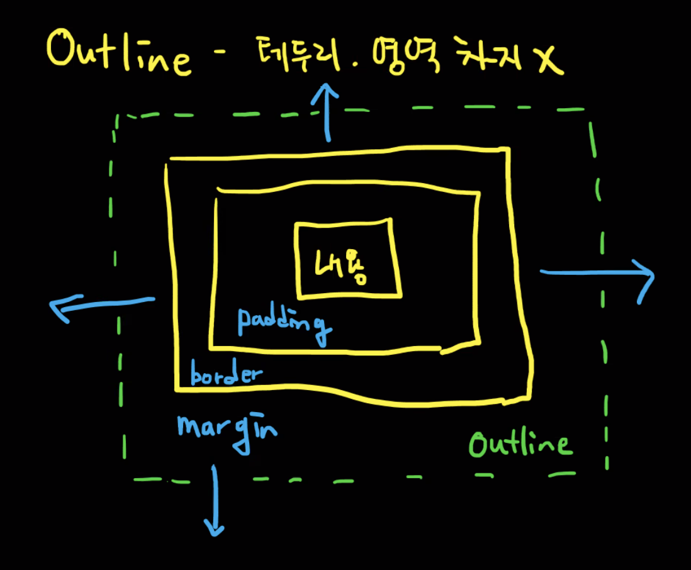
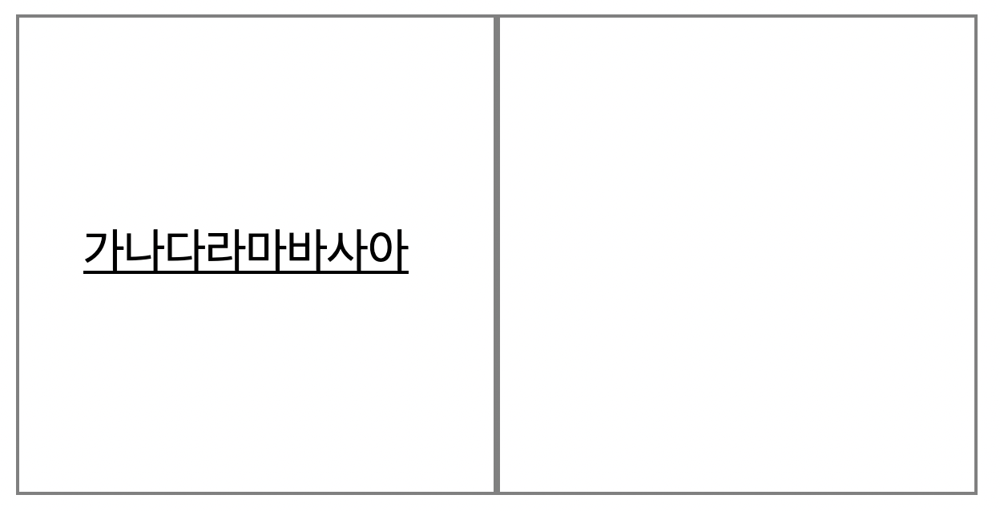
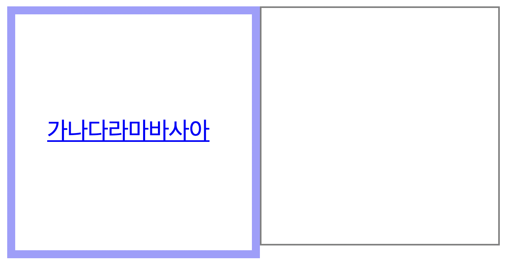
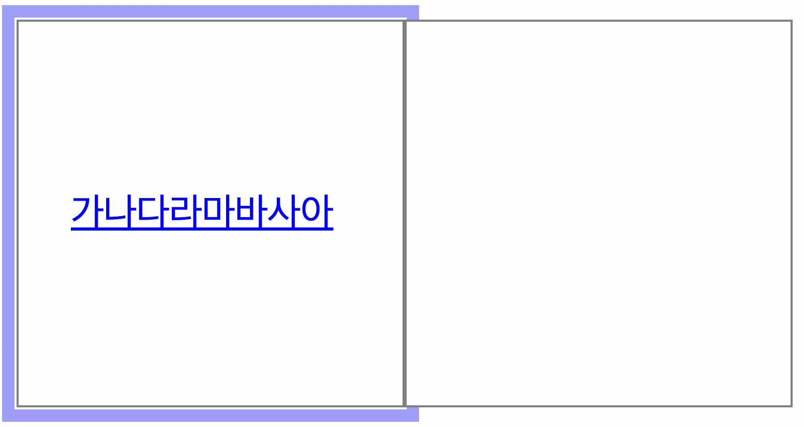
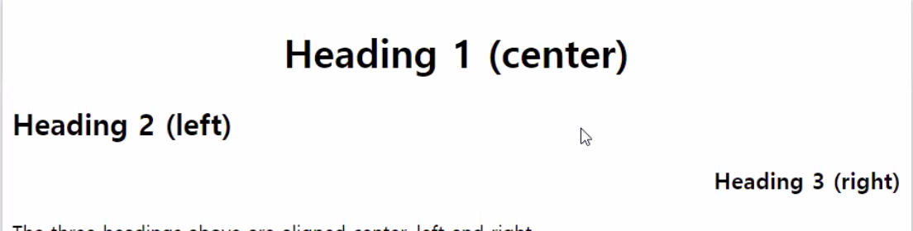
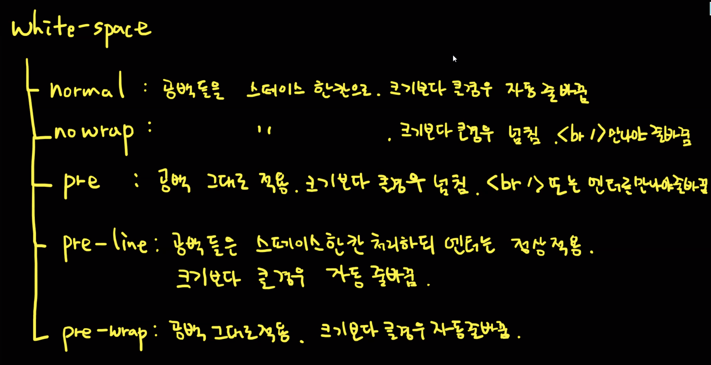

---

## 1. CSS Outline - 테두리. 영역 차지 X

> 아웃라인은 요소의 테두리 외부에 그려진 선.

### outline은 border와 다름. outline은 border 외부에 그려지며 다른 내용과 겹칠 수 있다.

- outline은 사용자가 어디에 있는지 알려주기 위해서(포커싱) 주로 사용한다.
- `outline: 5px solid yellow` : 두께, 색깔, 스타일 등을 한번에 지정 가능하다.
- `hover`에서의 `outline` 활용
    - hover 안에 border일 때는, 옆 영역이 밀려나는데, outline은 안 밀려남.
        
        
        
        
        
        border일 때는, 옆 영역이 밀려난다.
        
    - hover 안에 outline일 때는, 나중에 그려지는 것이 위로 올라옴. outline 쓸 때 겹치는 것을 조심해야함.
        
        
        
        - 애초에 `margin`으로 간격을 주면 겹쳐지는 현상이 생기지 않음.
- `outline-offset:` : border 영역에서 얼마나 떨어져서 그릴지

## 2. CSS Text

- Text Color
    - ex) `color: blue;`
- Text Alignment
    - ex) `text-alignment: center;`
    - 글자만 정렬한다고 생각할 수 있는데, 내용물을 정렬한다는 뜻임. 이미지도 가능.
    - center, left, right. 기본값은 레프트 기준으로 되어있다.
        
        
        
    - justify는 잘 안씀 - 각 줄이 동일한 너비를 갖도록 선을 늘린다.(신문 및 잡지처럼)
- Text Decoration
    - ex) `text-decoration: underline;`
    - `overline` : 윗줄이 쳐짐. 쓸일이 없음
    - `line-through` : 취소선
    - `underline;` : 글자에 밑줄이 쳐짐
- Text Transformation - 영문의 대소문자를 조정하는 속성.
- Text Spacing
    - `text-indent:`  : 들여쓰기
    - `letter-spacing:`  : 자간
    - `line-height:`  : 행간. **글씨를 세로 기준, 가운데로 보내기 가능.** 줄간격. 단위가 없을 경우 글자크기 * 수치만큼의 영역을 한줄로 인식
    - `word-spacing:`  : 단어 사이의 공백을 지정.
    - `white-space:`  : 공백 처리 방법을 지정.
        
        
        
        - `normal` : 공백들을 스페이스 한 칸으로. 크기보다 클 경우 자동 줄 바꿈. 아래로는 뚫고 나감.
        - `nowrap` : 공백들을 스페이스 한 칸으로. 크기보다 클 경우 넘침.   만나야 줄바꿈.
        - `pre` : 공백 그대로 적용. 크기보다 클 경우 넘침.   또는 엔터를 만나야 줄바꿈.
        - `pre-line` : 공백들을 스페이스 한 칸 처리하되, 엔터는 정상 적용. 크기보다 클 경우 자동 줄바꿈.
        - `pre-wrap` : 공백 그대로 적용. 크기보다 클 경우 자동 줄 바꿈.

## 3. CSS Overflow

- 내용물이 넘쳤을 때 어떻게 할 것인가를 제어함.
- `overflow: visible` : 기본값. 내용이 넘치는 것이 잘리지 않고 다 보임.
- `overflow: hidden` : 내용이 넘치는 것은 잘리고 나머지가 보이지 않음.
- `overflow: scroll` : 내용이 넘치는 것은 잘리고 스크롤 막대가 추가되어 넘친 내용을 볼 수 있음.
- `overflow: auto` : scroll과 비슷하지만 필요한 경우에만 스크롤 막대가 추가됨.
- `overflow-x`, `overflow-y` : 넘치는 내용을 수평 또는 수직으로 변경할지 여부 지정
- `**text-overflow` - 글자가 overflow 됐을 경우**
    - `clip` : 기본값, 텍스트가 잘림.
    - `ellipsis` : 줄임표(”...”)로 잘린 텍스트를 나타냄.
        - 줄임표를 사용하려면, 세 가지 조건이 갖춰져야 하고, 텍스트가 위치한 영역의 크기가 지정되어야 함.
            - → `overflow: hidden`, `white-space: nowrap`, `text-overflow: ellipsis`

## 4. CSS Font

- 글꼴을 적용하는 가장 간단한 방법은 font-family를 사용하는 것.
    - 글꼴 이름이 두 단어 이상인 경우 "Times New Roman"처럼 따옴표로 표시해야 함.
    - `font-family: 궁서, 돋움, 굴림;`
- Font style
    - font-style: `normal`, `italic`, `oblique` (italic과 oblique 차이 없음.)
- Font weight - 텍스트의 두께
    - font-weight: `normal`, `bold`, `900` (값을 직접 입력하는 것은 가능한 범위까지만 사용 가능.)
- Font Variant - 작은 대문자 글꼴 표시. 잘 안씀.
- Font Size - 텍스트의 크기
    - `font-size: 40px;`