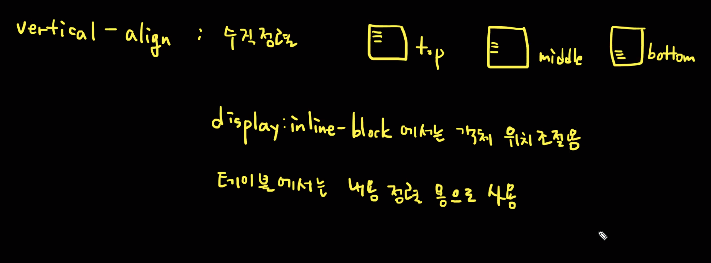
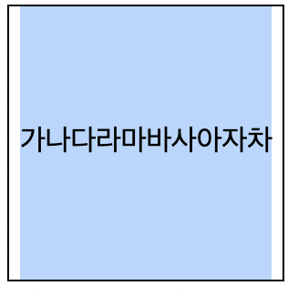
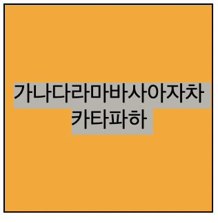
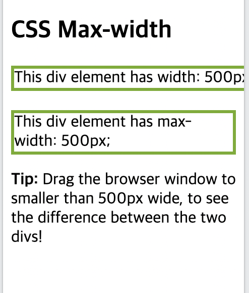
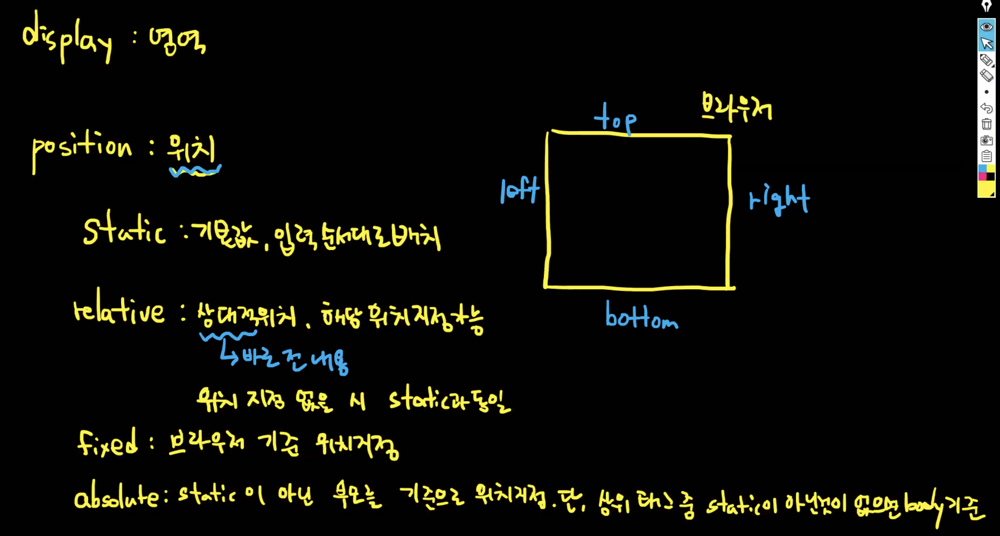
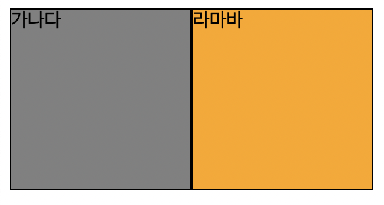
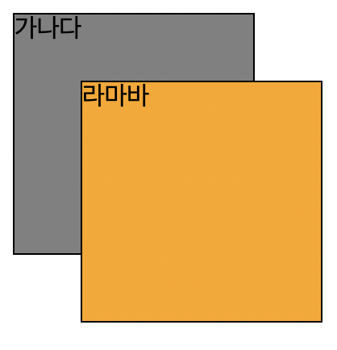
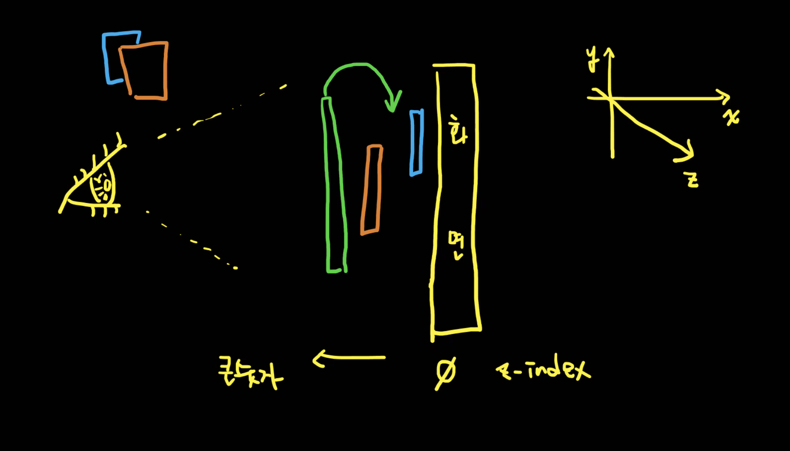
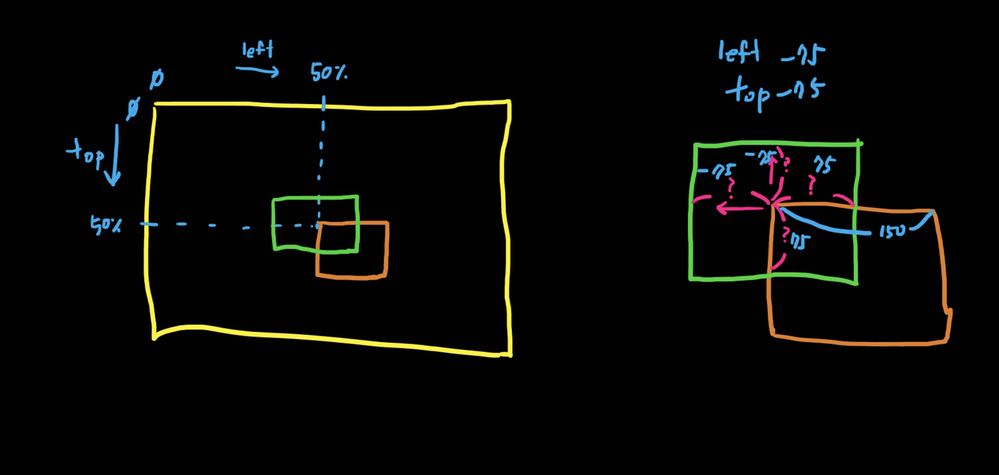
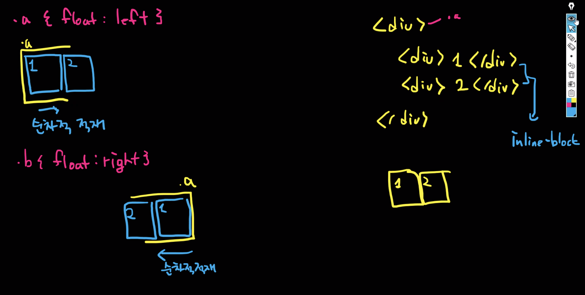

## 목차

- [목차](#목차)
- [CSS Lists](#css-lists)
- [CSS Tables](#css-tables)
- [Cursor](#cursor)
- [Display - 영역을 나타냄](#display---영역을-나타냄)
- [Max-width](#max-width)
- [Position - 위치를 나타냄](#position---위치를-나타냄)
- [Float](#float)

## CSS Lists

- 순서가 없는 목록 - Unordered Lists(ul)
    - 마커를 글머리로 표시
- 순서가 있는 목록 - Ordered Lists(ol)
    - 마커를 숫자나 문자로 표시

- `list-style-type`
    - squre - 마커를 사각형으로 표시
    - circle - 마커를 원으로 표시
    - upper-roman - 마커를 대문자 로마자로 표시
    - lower-alpha - 마커를 소문자 알파벳으로 표시

- `list-style-image`
    - 마커를 이미지로 지정
    - ex) `list-style-image: url('image.png')`

- `list-style-position`
    - 마커의 위치를 지정
    - outside - 마커가 목록 항목의 외부에 있다.
    - inside - 마커가 목록 항목의 내부에 있다. 텍스트의 일부가 되며 텍스트를 밀어넣음.

- `list-style-type: none` 을 사용해 마커를 제거할 수 있고, 기본 여백과 패딩을 제거할 수 있음
    
    ```css
    ul {
      list-style-type: none;
      margin: 0;
      padding: 0;
    }
    ```
    
- `list-style`로 한번에 지정할 수도 있음
    
    ```css
    ul {
      list-style: square inside url("sqpurple.gif");
    }
    ```
    
- List에 색깔 주는 것은 background, margin, padding으로 가능
    
    ```css
    ol {
      background: #ff9999;
      padding: 20px;
    }
    
    ol li {
      background: #ffe5e5;
      padding: 5px;
      margin-left: 35px;
    }
    ```
    

## CSS Tables

> HTML 테이블의 모양은 CSS를 통해 크게 개선될 수 있다.
> 

- `border-collapse`
    - 테이블 테두리를 단일 테두리로 다룰 것인지 설정. 테두리와 관련된 내용을 사용자 지정으로 사용.
    
    ```css
    table {
      border-collapse: collapse;
    }
    ```
    
    - 그냥 table에 border를 주면 외곽 테두리에만 적용됨.

- **`nth-child()` selector**
    - `:nth-child(n)`
    - 유형에 관계없이 부모 요소의 n번째 자식인 모든 요소와 일치. 상태값을 나타내는 것.  n은 숫자, 키워드 또는 수식이 될 수 있다.
    - `odd`, `even` : odd는 홀수, even은 짝수.
        
        ```css
        tbody tr:nth-child(odd) { /* 홀수번째 tr만 배경색을 넣겠다.  */
        	background-color: #CECECE;
        }
        ```
        

- **Table Alignment**
    - **text-align : 수평 정렬.** left, center, right가 있다.
        - 기본적으로 <th> 요소는 중심 정렬. <td> 요소는 왼쪽 정렬이 기본값.
    - **vertical-align : 수직 정렬**. top, middle, bottom이 있다.
        
        
        
        - `display: inline-block`에서는 객체 위치 조절용
        - 테이블에서는 **내용 정렬용**으로 사용

## Cursor

- cursor: 특정 요소 위를 가리킬 때 표시할 마우스 커서를 지정
    
    ```css
    tbody tr:hover {
    	background-color: orange;
    	cursor: pointer;
    }
    ```
    

## Display - 영역을 나타냄

> 디스플레이 속성은 레이아웃을 제어하는 가장 중요한 CSS 속성
> 

- `display: none` - 보여지지 않으며, 영역이 존재하지 않는다.
- `visibility: hidden` - 영역은 존재하나 보여지지 않는다.
- flex, grid - 잘 쓰면 편한데, 못 쓰면 힘들다.
- `display: table-cell` - 요소가 <td> 요소처럼 동작하도록 함.
    - 내용을 수직정렬 할 때 <td>를 써야 하는 이유는 <td>일 때만 내용이 수직정렬을 하기 때문.
        
        ```css
        .d {
        	display: inline-table
        	width: 150px;
        	height: 150px;
        	border: 1px solid #000;
        }
        
        .d > div {
        	display: table-cell;
        	height: 150px;
        	text-align: center;
        	vertical-align: middle;
        	background-color: orange;
        } 
        ```
        
    - 다른 것들(vertical-align 등)은 나 자체가 어떻게 정렬될 것인지를 얘기하는 것임.
    - 수직정렬 - `display: table-cell`과 `line-height` 중 선택
        - table-cell은 텍스트만 드래그 되고, line-height는 해당 영역 전체가 드래그 됨
            
            
            
            
            

## Max-width

- 브라우저 창이 요소의 너비보다 작을 때, Max-width를 사용하면 요소가 브라우저 크기에 맞게 너비가 조절된다.
- width: 100% - 브라우저 크기 창에 맞게 항상 최대 너비 사용





## Position - 위치를 나타냄

지금까지는 도화지 한장에 그렸다.

- `position: static` - 기본값, 입력 순서대로 배치. 위치 지정 불가능.
- `position: relative` - 상대적(바로 전 내용 기반) 위치. 해당 방향의 위치 지정 가능. 위치 지정 없으면 static하고 똑같다.
- `position: fixed` - 브라우저 기준 위치 지정 - 사용성을 높이기 위해서 잘 안쓰는 추세. 다크모드 같은 것
- `position: absolute` - static이 아닌 부모를 기준으로 위치 지정. 단, 상위 태그 중 static이 아닌 것이 없으면 body 기준.
    - 그냥 `position: absolute` 하면 앞 요소에 딱 붙음.
        
        
        
    - top과 left 값을 함께 넣어주면 body 기준으로 움직임.(상위 태그 중 static 아닌 것이 없기 때문)
        - top과 left에 %도 가능함.
        
        ```css
        .b {
        	background-color: orange;
        	position: absolute; /* 그냥 하면 앞에 요소에 딱 붙음 */
        	top: 50px;
        	left: 50px;
        }
        ```
        
        
        
    - 두 요소가 겹치게 됨. 나중에 그린 것이 위로 올라온다. 요소의 z축 조절이 필요할 수도 있다.
        
        
        

- `z-index` : 요소의 z축을 컨트롤 할 수 있음. 위로 올라오면 좋겠는 요소의 z-index 값을 **상대적으로 크게** 준다.
    
    ```css
    z-index: 50;
    ```
    
    - 하지만 z-index는 position이 사용된 요소에서만 작동.

- top과 left를 활용해 화면의 중앙으로 배치할 수도 있다.
    
    
    
    ```css
    .b {
    display: inline-block;
    vertical-align: top;
    width: 148px;
    height: 148px;
    border: 1px solid #000;
    background-color: orange;
    position: absolute;
    top: calc(50% - 75px);
    left: calc(50% - 75px); 
    }
    ```
    
    - 50px은 body 기준으로 그만큼 떨어짐. 50%는 body 기준으로 가운데.
    - calc 사용 시 부호와 값의 구분을 띄어쓰기로 구분한다.
    

## Float

- inline-block이랑 비슷하다.
- 요소를 왼쪽이나 오른쪽에 배치할 수 있음.
- 하지만 순차적으로 적재하기 때문에, 배치를 바꾸면 순서가 바뀔 수 있음.

