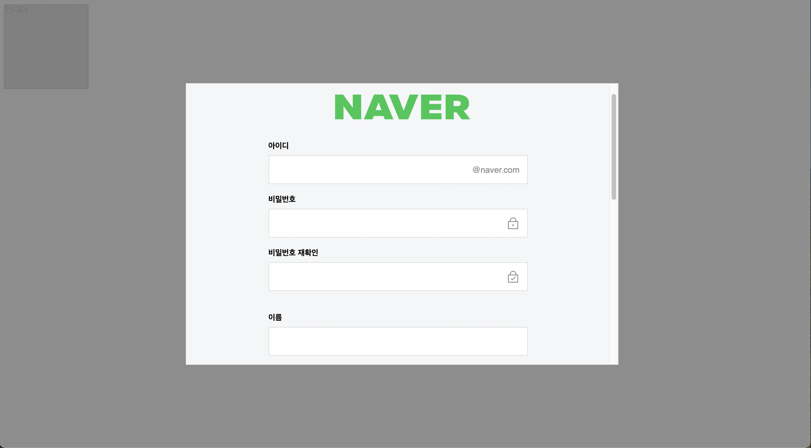
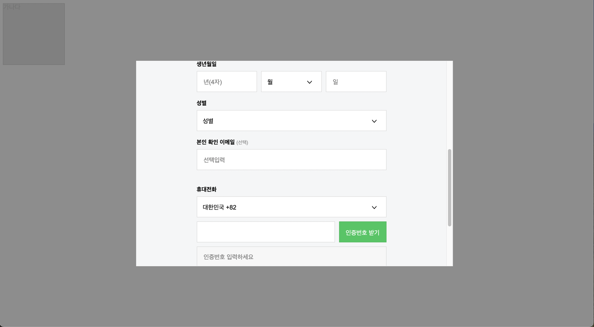

## 네이버 회원가입 화면 따라 만들기 실습

팝업창에 회원가입 화면을 표시하기.
회원가입 화면은 네이버의 회원 가입 화면을 따라 만듦.

---





```html
<!DOCTYPE html>
<html>
<head>
<meta charset="UTF-8">
<title>Insert title here</title>
<style type="text/css">
body {
	font-family: Dotum,'돋움',Helvetica,sans-serif;
}

.a, .b {
	display: inline-block;
	vertical-align: top;
	border: 1px solid #000;
}

.a {
	background-color: gray;
	width: 148px;
	height: 148px;
}

.b {
	width: 766px;
	height: 498px;
	background-color: #f5f6f7;
	border: 1px solid #f5f6f7;
	position: absolute; /* 그냥 하면 앞의 요소에 딱 붙음 */
	top: calc(50% - 250px); /* 50px은 바디 기준으로 그만큼 떨어짐. 50%는 바디 기준으로 가운데. */
	left: calc(50% - 389px); /* calc 사용 시 부호와 값의 구분을 띄어쓰기로 구분한다. */
	/* margin-top: -75px;
	margin-left: -75px; */
	z-index: 100;
	overflow-y: scroll;
	overflow-x: hidden;
}

.bg {
	position: absolute;
	width: 100%;
	height: 100%;
	top: 0px;
	left: 0px;
	background-color: gray;
	z-index: 50;
	opacity: 0.9;
}

.header {
	max-width: 768px;
	min-width: 460px;
	padding: 60px 0 20px;
}

.logo_area {
	width: 768px;
	height: 44px;
	text-align: center;
}

.h_logo {
	display: block;
    margin: 0 auto;
    width: 240px;
    height: 44px;
    background-image: url(https://static.nid.naver.com/images/ui/join/m_naver_logo_20191126.png);
    background-repeat: no-repeat;
    background-position: 0 0;
    background-size: 240px auto;
    color: transparent;
    font-size: 0;
}

.container {
	max-width: 768px;
	min-width: 460px;
	height: 1027px;
	margin: 0 auto;
}

.content {
	width: 460px;
	height: 1006px;
	margin: 0 auto;
}

.join_content {
	width: 460px;
	height: 1006px;
	margin: 0 auto;
}

.row_group {
    width: 100%;
    overflow: hidden;
}

.row_group+.row_group {
	margin-top: 20px;
}

.row_group+.join_mobile {
	margin-top: 20px;
}

.join_title {
	margin: 19px 0 8px;
	font-size: 14px;
	font-weight: 700;
}

label {
	cursor: pointer;
}

.id_box {
	position: relative;
	width: 100%;
	height: 51px;
	border: solid 1px #dadada;
	background-color: #fff;
	padding: 10px 110px 10px 14px;
	box-sizing: border-box;
}

.id_box2 {
	display: table;
    width: 100%;
}

.int {
	display: block;
    position: relative;
    width: 100%;
    height: 29px;
    padding-right: 25px;
    line-height: 29px;
    border: none;
    background: #fff;
    font-size: 15px;
    box-sizing: border-box;
}

.step_url {
	position: absolute;
	top: 16px;
    right: 13px;
    font-size: 15px;
    line-height: 18px;
    color: #8e8e8e;
}

.lock {
	content: '';
    display: inline-block;
    position: absolute;
    top: 50%;
    right: 13px;
    width: 24px;
    height: 24px;
    margin-top: -12px;
    background-image: url(https://static.nid.naver.com/images/ui/join/m_icon_pw_step.png);
    background-repeat: no-repeat;
    background-position: 0 0;
    background-size: 125px 75px;
    cursor: pointer;
}

.lock2 {
	content: '';
    display: inline-block;
    position: absolute;
    top: 50%;
    right: 13px;
    width: 24px;
    height: 24px;
    margin-top: -12px;
    background-image: url(https://static.nid.naver.com/images/ui/join/m_icon_pw_step.png);
    background-repeat: no-repeat;
    background-size: 125px 75px;
    cursor: pointer;
	background-position: -27px 0;
}

.join_birthday {
	width: 100%;
	height: 76px;
}

.bir_wrap {
	display: table;
	width: 100%;
}

.bir_yy {
	display: table-cell;
	table-layout: fixed;
	width: 147px;
	vertical-align: middle
}

.bir_mm {
	display: table-cell;
	table-layout: fixed;
	width: 147px;
	vertical-align: middle
}

.bir_dd {
    display: table-cell;
	table-layout: fixed;
	width: 147px;
	vertical-align: middle
}

.bir_yy+.bir_mm {
	padding-left: 10px;
}

.bir_mm+.bir_dd {
	padding-left: 10px;
}

.ps_box {
	position: relative;
	width: 100%;
	height: 51px;
	border: solid 1px #dadada;
	background: #fff;
	box-sizing: border-box;
	padding: 11px 14px;
}

.sel {
    background: #fff url(https://static.nid.naver.com/images/join/pc/sel_arr_2x.gif) 100% 50% no-repeat;
    background-size: 20px 8px;
    width: 100%;
    height: 29px;
    font-size: 15px;
    line-height: 18px;
    color: #000;
    border: none;
    border-radius: 0;
    -webkit-appearance: none;
}

.terms_choice {
	font-size: 12px;
	font-weight: 400;
	color: #8e8e8e;
}

.box_right_space {
	padding-right: 14px;
	box-sizing: border-box;
}

.int_mobile_area {
    position: relative;
    margin-top: 10px;
    padding: 0 125px 0 0;
}

.join_mobile {
	position: relative;
	overflow: hidden;
}

.int_mobile {
	display: inline-block;
	width: 100%;
	padding: 10px 15px 10px 14px;
	vertical-align: top;
}

.join_mobile .int_mobile_area .btn_verify {
	position: absolute;
	top: 0;
	right: 0;
	width: 115px;
	height: 51px;
	padding: 18px 0 16px;
	text-align: center;
	box-sizing: border-box;
	text-decoration: none;
}

.join_mobile .ps_box_disable, .join_mobile .ps_box_disable input {
	background: #f7f7f7;
	outline: 0;
}

.int_mobile_area+.ps_box, .int_mobile_area+.ps_box_disable, .ps_box_disable+.ps_box {
    margin-top: 10px;
}

.box_right_space {
	padding-right: 14px;
	box-sizing: border-box;
}

.ps_box_disable {
	display: block;
	position: relative;
	width: 100%;
	height: 51px;
	border: solid 1px #dadada;
	padding: 10px 110px 10px 14px;
	vertical-align: top;
}

.btn_verify {
	display: block;
	font-size: 15px;
	cursor: pointer;
}

.btn_primary {
	color: #fff;
	border: solid 1px rgba(0,0,0,.08);
	background-color: #03c75a;
}

.btn_type {
	display: block;
	width: 100%;
	padding: 15px 0 15px;
	font-size: 18px;
	font-weight: 700;
	text-align: center;
	cursor: pointer;
	box-sizing: border-box;
}

.lbl {
	display: block;
    position: absolute;
    top: 50%;
    left: 14px;
    margin-top: -9px;
    font-size: 15px;
    line-height: 18px;
    color: #8e8e8e;
    z-index: 9;
}

.wa_blind {
	position: absolute;
    overflow: hidden;
    clip: rect(0 0 0 0);
    margin: -1px;
    width: 1px;
    height: 1px;
    font-size: 0;
}

.input_code {
	position: absolute;
    top: 50%;
    right: 10px;
    background: 0 0;
    font-size: 12px;
    z-index: 10;
}

.btn_area {
	margin: 30px 0 9px;
}

#footer {
	margin: 0 auto;
	max-width: 768px;
	min-width: 460px;
	height: 84px;
	clear: both;
    margin: 0 auto;
    padding: 30px 0 15px 0;
    text-align: center;
}

</style>
</head>
<body>
	<div class="a">가나다</div>
	<div class="b">
		<div class="header">
			<div class="logo_area">
				<a href="http://www.naver.com" class="h_logo">NAVER</a>
			</div>
		</div>
		<div class="container">
			<div class="content">
				<div class="join_content">
					<div class="row_group">
						<div class="join_row">
							<div class="join_title">
								<label for="id">아이디</label>
							</div>
							<div class="id_box">
								<input type="text" class="int" maxlength="20">
								<span class="step_url">@naver.com</span>
							</div>
						</div>
						<div class="join_row">
							<div class="join_title">
								<label for="pw">비밀번호</label>
							</div>
							<div class="id_box">
								<input type="text" class="int" maxlength="20">
								<span class="lock"></span>
							</div>
							<div class="join_title">
								<label for="pw">비밀번호 재확인</label>
							</div>
							<div class="id_box">
								<input type="text" class="int" maxlength="20">
								<span class="lock2"></span>
							</div>
						</div>
					</div>
					<div class="row_group">
						<div class="join_row">
							<div class="join_title">
								<label for="id">이름</label>
							</div>
							<div class="id_box">
								<input type="text" class="int" maxlength="100">
							</div>
						</div>
						<div class="join_row join_birthday">
							<div class="join_title">
								<label>생년월일</label>
							</div>
							<div class="bir_wrap">
								<div class="bir_yy">
									<div class="ps_box">
										<input type="text" class="int" placeholder="년(4자)" maxlength="4">
									</div>
								</div>
								<div class="bir_mm">
									<div class="ps_box">
										<select class="sel" aria-label="월">
											<option>월</option>
											<option value="01">1</option>
											<option value="02">2</option>
											<option value="03">3</option>
											<option value="04">4</option>
											<option value="05">5</option>
											<option value="06">6</option>
											<option value="07">7</option>
											<option value="08">8</option>
											<option value="09">9</option>
											<option value="10">10</option>
											<option value="11">11</option>
											<option value="12">12</option>
										</select>
									</div>
								</div>
								<div class="bir_dd">
									<div class="ps_box">
										<input type="text" class="int" placeholder="일">
									</div>
								</div>
							</div>
						</div>
						<div class="join_row join_sex">
							<div class="join_title">
								<label>성별</label>
							</div>
							<div class="ps_box gender_code">
								<select class="sel">
									<option>성별</option>
									<option value="M">남자</option>
									<option>여자</option>
									<option>선택 안함</option>
								</select>
							</div>
						</div>
						<div class="join_row join_email">
							<div class="join_title">
								<label>본인 확인 이메일
									<span class="terms_choice">(선택)</span>
								</label>
							</div>
							<div class="ps_box int_email box_right_space">
								<input type="text" placeholder="선택입력" class="int" maxlength="100">
							</div>
						</div>
					</div>
					<div class="join_row join_mobile">
						<div class="join_title">
							<label>휴대전화</label>
						</div>
						<div class="ps_box country_code">
							<select class="sel">
								<option>가나 +233</option>
								<option>가봉 +241</option>
								<option>가이아나 +592</option>
								<option selected>대한민국 +82</option>
							</select>
						</div>
						<div class="int_mobile_area">
							<span class="ps_box int_mobile">
								<input type="tel" class="int" maxlength="16">
							</span>
							<a href="http://naver.com" class="btn_verify btn_primary">
								<span>인증번호 받기</span>
							</a>
						</div>
						<div class="ps_box_disable box_right_space"">
							<input type="tel" placeholder="인증번호 입력하세요" class="int" disable maxlength="4">
							<label class="lbl">
								<span class="wa_blind">인증받은 후 인증번호를 입력해야 합니다.</span>
								<span class="input_code" style="display: none;"></span>
							</label>
						</div>
					</div>
					<div class="btn_area">
						<button type="button" class="btn_type btn_primary">
							<span>가입하기</span>
						</button>
					</div>
				</div>
			</div>
		</div>
		<div id="footer">
			
		</div>
	</div>
	<div class="bg"></div>
</body>
</html>

```