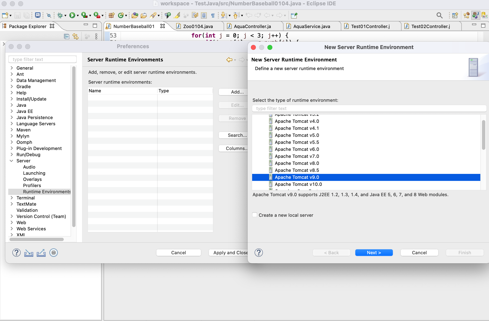

### HTML
- [HTML이란?](#html이란)
- [tomcat 설치](#tomcat-설치)
- [인터넷 발전사](#인터넷-발전사)
- [HTML 태그](#html-태그)

## HTML이란?

## tomcat 설치

[tomcat.apache.org](http://tomcat.apache.org) 톰캣 설치(Download → Tomcat 9 → Core에서 zip 파일 받기 → 맥은 tar.gz 버튼 눌러서 설치)

이클립스 환경설정에서 서버 → Runtime Environments → add → 아파치 9.0




HTML, CSS, JSP 설정에서 UTF8로 바꿔줌


오늘부터 웹이라는 것에 한발짝 들어간다.

자바 EE 클릭 → 프로젝트 익스플로러로 바뀜

New → 다이나믹 웹 프로젝트 


→ TestWeb → 모듈버전 3.1

프로젝트에 지구본 달린게 웹 프로젝트다 구조도 다르다 지금껏 보는거랑

src → main → webapp 여기에서 html css 작업함.

webapp에서 우클릭 뉴 HTML → 


아래 서버탭에서 뉴 서버

톰캣 9.0 더블클릭


우리가 설치한 톰캣은 원본 톰캣이고, 이클립스 입장에서는 가상으로 복제해서 쓸래요 라고 말하는 것. 이클립스에서 실행하는 톰캣은 가상 서버임.

서비스에 접근할 수 있는 접근 번호 (포트)

톰캣도 포트를 가지고 있음. 관리용 포트랑 웹용 포트가 있음

오라클에서 포트를 쓰고 있음

톰캣 포트넘버 8015, 8090으로 변경함.

컨트롤 + s로 톰캣서버 저장

HTML 실행하면 웹에서 열림

w3c - 웹 표준 개발 기구 - 전세계의 웹 표준을 정립

w3schools 여러가지 교육을 제공


## 인터넷 발전사

인터넷 발전사부터 얘기해야하는 게 처음에 인터넷이라는 게 나왔는데, 이 인터넷이라는 용어가 정립되기 전에 제일 처음 썼던 용어는 우리나라에서는 PC통신. 

PC통신 - 모뎀이라는 것을 통해서 전화선을 써서 데이터를 주고 받았다. 느리다. 손실율 높다. 

모뎀은 보낼 수 있는 데이터가 제한적이고, 글만 보내는 수준이었음.

전화선에서 광랜(랜선)으로 바뀜. 전화선은 구리선이었는데, 광랜은 섬유로 되어있다. 광랜으로 바뀌면서 속도가 MB단위로 올라감. 보낼 수 있는 데이터가 많아짐. 데이터를 효율적으로 볼 수 없을까? 하는 고민에서 나온 것이 HTML(Hyper Text Markup Language)

Hyper Text : 구조, 미디어(이미지, 소리)

HTML 버전이 1.x에서 4.0까지 왔다가 5가 수정중.

1~4는 표준을 잡았다고 한다면, 5부터는 HTML에서 기능구현을 하면 어떨까 해서 나온 것.


## HTML 태그

HTML - 구조적이다. tree형태로 구성. 태그안에 태그와 태그가 있는 구조.

```html
<태그명 Attribute = 값>
Entity
</태그명>
```

HTML은 어트리뷰트, 엔티티, 태그네임으로 이뤄져있다고 얘기함.

*** 단, 브라우저에 따라 태그의 표현방식(화면 드로잉)의 차이가 존재

같은 태그를 썼다고 해도 브라우저에 따라서 표현방식이 다르다.

브라우저 엔진에서 화면을 그려야 하는데 그것이 조금씩 다르다.

MS에서 Explorer 자기네들만의 기준을 만들어서 썼음. 근데 버전마다 또 다름. 엣지도 버전마다 다르다가 크롬엔진을 얹었음. 웹표준이 어느정도 지켜지는 시기가 오고 있음.

태그를 어떤 태그를 써야할지 비교하기위해 브라우저를 많이 켜놓고 작업. 

w3school → HTML Introduction

<!DOCTYPE html> : 이게 옛날에는 길었다. 버전정보 다 기재해야해서. 5버전으로 넘어오면서, 버전정보 빠짐. HTML을 문서라고 말함. 문서를 어떻게 화면에 띄우겠다는 형태. 

<HTML>

일반적 HTML에서의 스페이스와 엔터

→ 몇 개가 붙어있던지 공백 1개로 인식