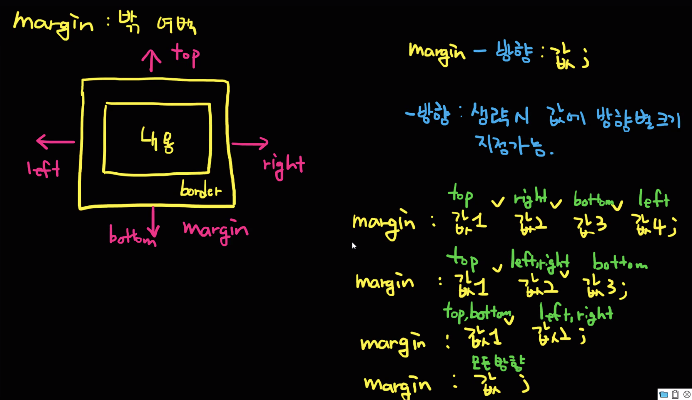
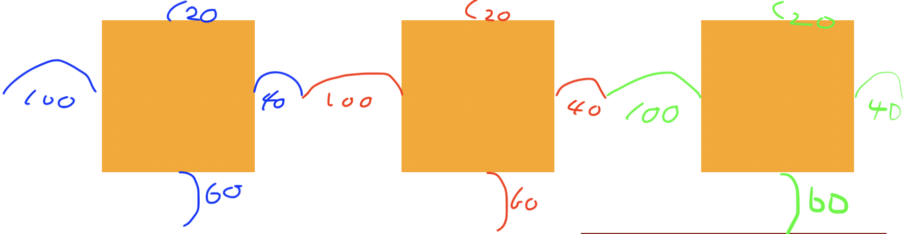
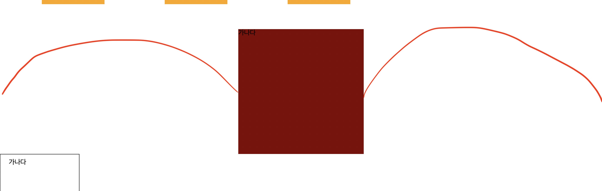
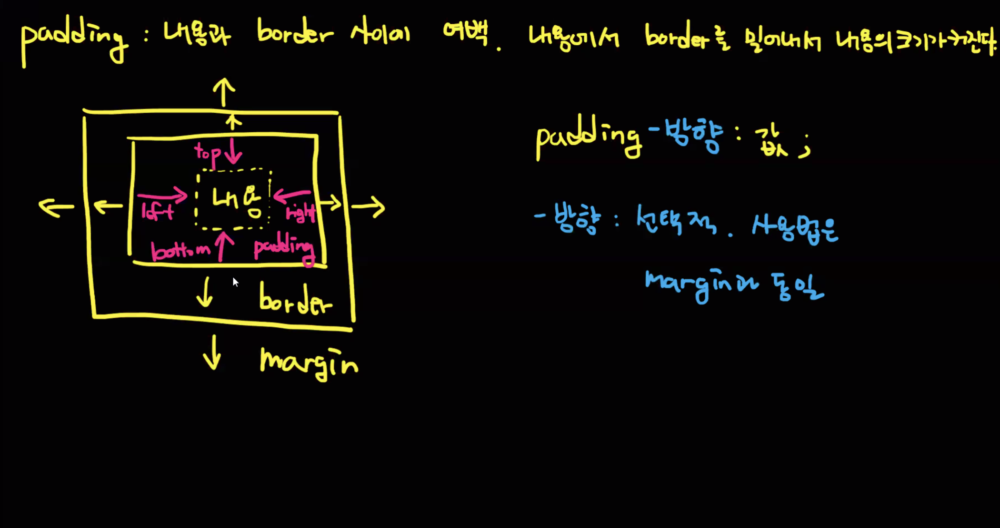
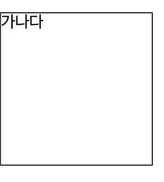
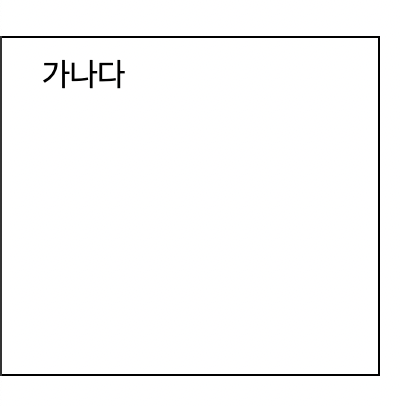
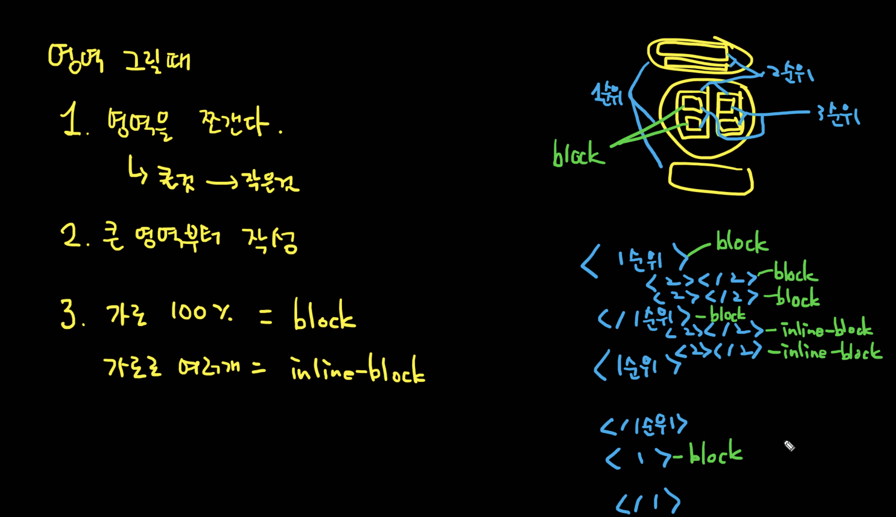

## 목차
1. Margin
2. Padding
3. HTML 기본 body 여백
4. 영역을 그릴 때
5. 실습


---

## 1. Margin



> `margin은 바깥 여백을 나타내는 것. 여백만큼 밀어내는 것이라고 보면 됨.`
> 

- 기본 사용
    - 값이 4개일 때는 시계 방향으로 margin 적용
        - *`margin: 20px 40px 60px 100px;`*
            
            
            
    - 값이 3개일 때는
        1. top
        2. left, right
        3. bottom
        - `margin: 20px 40px 60px;`
    - 값이 2개일 때는
        1. top,bottom
        2. left,right
        - `margin: 40px 60px;`
    - 값이 1개일 때는
        - 모든 방향
        - `margin: 20px;`

- auto : 소유한 여백을 균등분배
    - `margin: 0px auto;`
        
        
        

<br/>

## 2. Padding



`padding은 내용과 border 사이의 여백. 내용에서 border를 밀어내서 내용의 크기가 커진다.`

사용 방법은 margin과 동일하다.

- padding을 사용했을 때와 사용하지 않았을 때의 차이
  - padding을 사용하지 않았을 때
  
    
  
  - `padding: 10px 20px;` 를 줬을 때

    

<br/>

## 3. HTML 기본 body 여백

기본적으로 HTML에서는 사방에 여백이 생긴다. 여백을 없애려면, body에 마진 0을 주어야 함.

```html
body {
	margin: 0;
}
```

- Margin, Padding, Display 등은 영역을 어떻게 나타낼까에 대한 부분임.

## 4. 영역을 그릴 때



1. 영역을 쪼갠다.(네이버 같은 경우, 상단, 중단, 하단으로 쪼갬) → 큰 것에서 작은 것으로 쪼개는 것이 좋다.
2. 큰 영역부터 작성
3. 가로 100% = block
    1. 가로로 여러 개 = inline-block
    
<br/>

## 5. 실습 - 네이버 레이아웃 구현

1. 글자, 이미지 신경x
2. 올라와있는 화살표, 다크모드 등 신경x
3. 각 div 배경색으로 영역구분(색상을 다르게 줄 것)