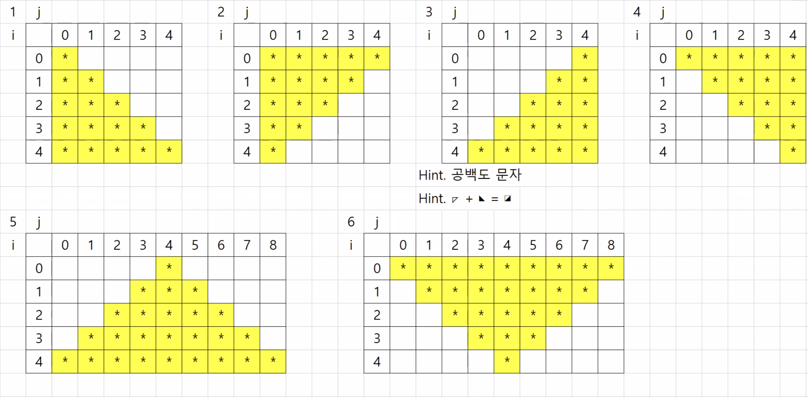

## 목차
1. 실습
   1. 1에서 100까지의 소수를 구하시오.
   2. 구구단 2~9단 출력
   3. 1에서 100까지의 숫자 중 소수 골라내기.
   4. 다중 반복문 활용해서 별 그리기
      1. 별 사각형 채우기
      2. 1번 문제
      3. 2번 문제
      4. 3번 문제 (if 활용)
      5. 3번 문제 (for 활용)
      6. 4번 문제 (if 활용)
      7. 4번 문재 (for 활용)
      8. 5번 문제 (for 활용)
      9. 5번 문제 (if 활용)
      10. 6번 문제
      11. 7번 문제

---

## 1. 실습
* 다중 반복문
  * 곱연산이 일어나게 됨. 실행 횟수가 많아지기 때문에 내용을 몇 번 수행하는지 파악해야함. 원하는 결과값이 안나올 수 있음. 곱연산이기 때문에. 위치에 따라서 실행 횟수가 달라짐. 다중 반복문이 어려운 이유.


### 1. 1. 1에서 100까지의 소수를 구하시오.
> (소수 : 1과 자기 자신으로만 나누어지는 수)
```java
for(int j = 1; j <= 100; j++ ) { // 1 ~ 100 생성
        int count = 0; // 소수 체크용 카운트
        for(int i = 1; i <= j; i++) {
            if(j % i == 0) { // 나누어지는지 확인
                count++;
        }
	}
	        if(count == 2) { // 1과 자기 자신으로만 나누어진 경우
				System.out.print(j + " ");
		}
}
```
1. 1~100을 만드는 반복문을 만들고 - 값을 만듦
2. 1~현재값 사이의 값을 구하여 나누어보는 반복문을 만들어야 함. - 소수 검증


### 1. 2. 구구단 2~9단 출력
```java
for(int a = 2; a < 10; a++) {
	System.out.println(" * " + a + "단 * ");
	for(int b = 1 ; b <= 9 ; b++) {
		System.out.println(a + " x " + b + " = " + a*b);
	}
}
```

### 1. 3. 1에서 100까지의 숫자 중 소수 골라내기.
```java		
for(int j = 1; j <= 100; j++ ) { // 1 ~ 100 생성
	int count = 0; // 소수 체크용 카운트
	for(int i = 1; i <= j; i++) {
		if(j % i == 0) { // 나누어지는지 확인
			count++;
		}
	}
	if(count == 2) { // 1과 자기 자신으로만 나누어진 경우
		System.out.print(j + " ");
	}
}
```

### 1. 4. 다중 반복문 활용해서 별 그리기
1. 별 사각형 채우기
```java
System.out.println("별 다 채우기");
for(int i = 0; i < 5; i++) {
	for(int j = 0; j < 5; j++) {
		System.out.print("*");
	}
	System.out.println();
}
```

2. 1번 문제


```java
System.out.println("1번 문제");
for(int i = 0; i < 5; i++) {
	for(int j = 0; j <= i; j++) {
		System.out.print("*");		
	}
	System.out.println();
}
```

1. 2번 문제
```java
System.out.println("2번 문제");
for(int i = 0; i < 5; i++) {
	for(int j = 0; j <= 4 - i; j++) {
		System.out.print("*");
	}
	System.out.println();			
}
```

4. 3번 문제 (if 활용)
```java
System.out.println("3번 문제(if 활용2)");
for(int i = 0; i < 5; i++) {
	for(int j = 0; j < 5; j++) {
		if(j >= 4 - i) {
			System.out.print("*");
		} else {
			System.out.print(" ");
		}
	}
	System.out.println();
}
```

5. 3번 문제 (for 활용)
```java
System.out.println("3번 문제(for 활용)");
for(int i = 0; i < 5; i++) {
	// 공백
   	for(int j = 0; j <= 3 - i; j++) {
		System.out.print(" ");
	}
	// 별
	for(int j = 0; j <= i; j++) {
		System.out.print("*");
	}
	// 줄바꿈
		System.out.println();
}
```

6. 4번 문제 (if 활용)
```java
System.out.println("4번 문제(if 활용)");
for(int i = 0; i < 5; i++) {
	for(int j = 0; j <5; j++) {
		if(i > j) {
			System.out.print(" ");
		} else {
			System.out.print("*");
		}
	}
	System.out.println();
}
```

7. 4번 문제 (for 활용)
```java
System.out.println("4번 문제(for 활용)");
for(int i = 0; i < 5; i++) {
	for(int j = 0; j < i; j++) {
		System.out.print(" ");
	}
	for(int j = 0; j <= 4 - i; j++) {
		System.out.print("*");
	}
	System.out.println();
}
```

8. 5번 문제 (for 활용)
```java
System.out.println("5번 문제(for 활용 강사님 해설)");
for(int i = 0; i < 5; i++) {
	for(int j = 0; j <= 3 - i; j++) {
		System.out.print(" ");
	}
	for(int j = 0; j < 1 + (2 * i); j++) {
		System.out.print("*");
	}
	System.out.println();
}
```

9. 5번 문제 (if 활용)
```java
System.out.println("5번 문제(if 활용 강사님 해설");
for(int i = 0; i < 5; i++) {
	for(int j = 0; j < 9; j++) {
		if(j < 4 - i || j >= 5 + i) {
			System.out.print(" ");
		} else {
			System.out.print("*");
		}
		
	}
	System.out.println();
}
```

10. 6번 문제
```java
System.out.println("6번 문제(if 활용 강사님 해설)");
for(int i = 0; i < 5; i++){
	for(int j = 0; j < 9; j++) {
		if(j < i || j >= 9 - i) {
			System.out.print(" ");
		} else {
			System.out.print("*");
		}
	}
	System.out.println();
}
```

11. 7번 문제
```java
System.out.println("7번 문제(강사님 해설)");
for(int i = 0; i < 9; i++) {
	for(int j = 0; j < 9; j++) {
		if(j <= 3 - i || j >= 5+i
		  || j <= i - 5 || j >= 13 - i) {
			System.out.print(" ");
		} else {
			System.out.print("*");
		}
	}
	System.out.println();
}
```