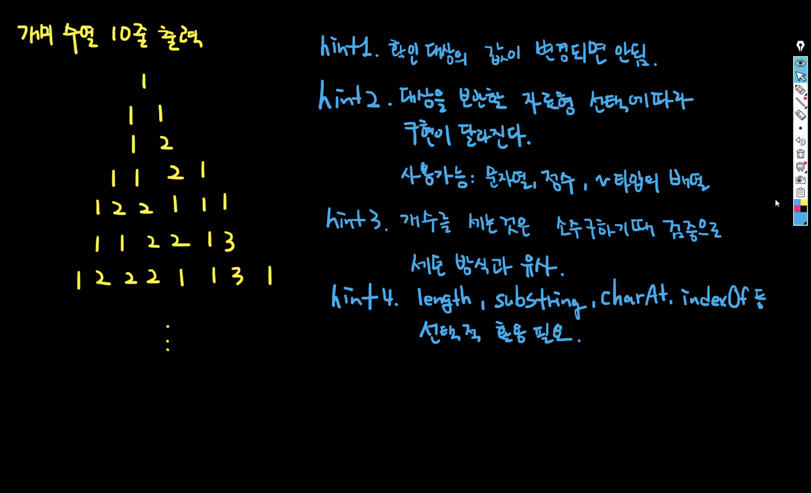

## 목차

- [목차](#목차)
- [1.  기본 자료형 형변환](#1--기본-자료형-형변환)
	- [1. 1. **숫자 → 숫자**](#1-1-숫자--숫자)
	- [1. 2. **숫자 → 문자열**](#1-2-숫자--문자열)
	- [1. 3. **문자열 → 숫자**](#1-3-문자열--숫자)
- [2. 그 외의 문자열을 다루는 기능들 (문자열 처리)](#2-그-외의-문자열을-다루는-기능들-문자열-처리)
- [3.  배열(Array)](#3--배열array)
- [4. for문에서 "순차적" 데이터 활용](#4-for문에서-순차적-데이터-활용)
	- [4. 실습 1 - 오름차수로 정렬](#4-실습-1---오름차수로-정렬)
	- [5. 실습 2 - 개미 수열 10줄 출력하기](#5-실습-2---개미-수열-10줄-출력하기)

---

## 1.  기본 자료형 형변환

> 형변환 : 변수들의 형태를 변환하는 작업

### 1. 1. **숫자 → 숫자**

1. `(바뀔 타입)값`
- 캐스팅 : 형변환 시 값 앞에 ( )로 타입을 지정하는 것. 캐스팅을 통해서 형태를 변환함
    
```java
(float)a
```
    
### 1. 2. **숫자 → 문자열**
1. `타입클래스.toString(값)`
        
```java
Integer.toString(a)
```
        
2. 타입 클래스 
    1. int → integer
    2. long → Long
    3. float → Float
    4. double → Double
2. 기능 메소드는 클래스에만 존재하기에, 변수는 기능 없음
   
### 1. 3. **문자열 → 숫자**
1. `타입클래스.parse타입(첫 글자는 대문자!)(값)`
    - 실수나 문자가 들어가면 에러 발생. 값의 타입이 해당 타입으로 들어왔는지 확인 해야함.
    
```java
Integer.parseInt("7");
```

<br/>

## 2. 그 외의 문자열을 다루는 기능들 (문자열 처리)

- `+`는 문자열을 이어준다.

```java
String s = "hello World!!";
System.out.println(s + "!!");
```

- `length()` : 문자열의 길이, 공백도 문자열!

```java
System.out.println(s.length());
```

- `substring(값)` : 문자열 인덱스를 값 이상부터 자른다.
- `substring(값1, 값2)` : 문자열 인덱스가 값1 이상부터 값2 미만까지 자른다.

```java
System.out.println(s.substring(3));
System.out.println(s.substring(7, 10));
```

- `replace(값1, 값2)` : 값1을 값2로 바꾼다.
- `replaceAll(값1, 값2)` : 값1을 값2로 바꾼다.
- `replaceFirst(값1, 값2)` : 값1을 값2로 첫 번째의 값만 바꾼다.
- 특정값만 지우고 싶을 때, `replace("l", "")`

```java
System.out.println(s.replace("l", "k"));
System.out.println(s.replaceAll("l", "k"));
System.out.println(s.replaceFirst("l", "k"));
```

- `indexOf(값)` : 값의 인덱스 위치를 찾겠다. (-1은 인덱스 상에 존재할 수 없는 숫자. 없다는 뜻으로 많이 씀.)
- `indexOf(값, 숫자)` : 인덱스 중 숫자 이상에서 값의 인덱스 위치를 찾겠다.

```java
System.out.println(s.indexOf("l"));
System.out.println(s.indexOf("l", 3));
System.out.println(s.indexOf("x")); // -1 은 없는 경우
```

- `lastindexOf(값)` : 값의 인덱스 위치를 뒤에서부터 찾겠다.
- `lastindexOf(값, 숫자)` : 인덱스 중 숫자 이하에서 값의 인덱스 위치를 찾겠다.

```java
System.out.println(s.lastIndexOf("l"));
System.out.println(s.lastIndexOf("l", 3));
```

- `charAt(숫자)` : 인덱스 중 숫자에 해당하는 글자를 가져온다.

```java
System.out.println(s.charAt(6));
```

- `equals(값)` : 값과 동일한지 여부를 제공. == 표시를 사용하지 못하는 클래스일 수도 있다. 문자열 비교를 할 때에는 무조건 equals를 사용해야 한다.

```java
System.out.println(s.equals("hello?"));
```

- `concat(값)` : +와 기능이 같다. 실제로는 잘 쓰지 않는다. + 쓰는 게 더 빠르니까.

```java
System.out.println(s.concat("haha"));
```

- `toLowerCase()` : 소문자화
- `toUpperCase()` : 대문자화
- 영어의 대, 소문자에 활용. 한글에는 해당 사항이 없다.

```java
System.out.println(s.toLowerCase());
System.out.println(s.toUpperCase());
```

- `trim()` : 앞 뒤의 공백을 제거. 중간의 공백은 제거하지 않는다.

```java
s = "            Hello!!         ABC!!                 ";
System.out.println(s);
System.out.println(s.trim());
```

<br/>

## 3.  배열(Array)

데이터를 연속된 공간에 나열하고 각 데이터에 인덱스를 부여한 자료구조

1. `타입[] 변수명 = new 타입[크기]` : 해당 크기의 배열을 생성한다.
2. `타입[] 변수명 = {값1, 값2, ..., 값n}` : 값의 개수와 동일한 크기의 배열을 생성한다.
    
```java
int [] arr = {1, 3, 5};
```
    
- 취득
  
	```java
	System.out.println(arr[1]); // 변수명[인덱스 번호]
	```
    
- 할당

    ```java
    arr[0] = 4;
    ```
    
- length는 배열의 크기
    
    ```java
    System.out.println(arr.length);
    ```
    
<br/>

## 4. for문에서 "순차적" 데이터 활용

```java
for(타입 변수명 : 순차적 데이터) {
내용
}
```

- 활용 방법
    1. 순차적 데이터에서 데이터를 가져와 변수에 넣는다.
    2. 내용을 실행한다.
    3. 다음 데이터를 가져와서 변수에 넣고 내용을 실행한다.
    4. 만약 다음 데이터가 없으면 for문을 종료한다.
- **주의사항** : 순차적 데이터 한 건의 타입과 사용할 변수의 타입이 동일 해야 한다.

<br/>

- `split(값)` : 값을 기준으로 문자열을 자르고 배열로 변환

```java
String s = "딸기,포도,사과";

String[] arrs = s.split(",");

System.out.println(arrs.length); // 3 출력
		
for(String t : arrs ) {
System.out.println(t); // 딸기, 포도, 사과 각각 출력
}
```
<br/>

### 4. 실습 1 - 오름차수로 정렬

```java
// 선언 (건들지 말 것)
int[] arr = {3, 7, 5);

// 오름차순 정렬
// hint : if만으로 선 구현 후 규칙을 찾아서 for문 활용

// 출력(건들지 말 것)
for(int a : arr) {
System.out.println(a);
}
```

- 풀이

```java
// if만으로 오름차순 정렬을 선 구현하고 규칙 찾기
int temp = 0;
if(arr[0] > arr[1]) {
	temp = arr[0];
	arr[0] = arr[1];
	arr[1] = temp;
}
if(arr[0] > arr[2]) {
	temp = arr[0];
	arr[0] = arr[2];
	arr[2] = temp;
}
if(arr[1] > arr[2]) {
	temp = arr[1];
	arr[1] = arr[2];
	arr[2] = temp;
}
```


```java
// 
int temp;
for(int i = 0; i < arr.length - 1; i++) { // - 1 을 빼는 건 리소스 낭비
	for(int j = i + 1; j < arr.length; j++) { // i = 0 을 하면 숫자 검사가 제대로 안됨
		if(arr[i] > arr[j]) { 
			temp = arr[i];
			arr[i] = arr[j];
			arr[j] = temp;
		}
	}
}
```

<br/>

### 5. 실습 2 - 개미 수열 10줄 출력하기



1. 풀이 1번 - substring, equals 활용

```java
// 풀이 1번 - substring + equals 활용
		
String val = "1"; // 대상
String res = ""; // 결과 문자열
String check = ""; // 숫자
int cnt = 0; // 개수
System.out.println(val);
for(int i = 0 ; i < 9 ; i++) { // 회수
	res = "";
	check = val.substring(0, 1); // 0번째 숫자 설정
	cnt = 1; // 개수 1
	for(int j = 1 ; j < val.length() ; j++) { // 1 ~ 마지막
		if(check.equals(val.substring(j, j + 1))) { // 같을 때
			cnt++; // 개수 증가
		} else { // 다를 때
			res += check + cnt; // 문자열누적
			check = val.substring(j, j + 1); // 숫자 변경
			cnt = 1; // 개수 1
		}
	}
	res += check + cnt; // 문자열 누적
	val = res; // 현재 결과값이 다음 대상이 됨
	System.out.println(res); // 출력
}
```

2. 풀이 2번 - 인덱스 값(position) + substring + equals 활용

```java
		// 풀이 2번 - 인덱스값 + substring + equals 활용
		String val = "1"; // 대상
		String res = ""; // 문자열
		int pos = 0; // 인덱스
		System.out.println(val);

		for (int i = 0; i < 9; i++) {
			res = "";
			pos = 0;
			
			for(int j = 1 ; j < val.length() ; j++) {
				if(val.charAt(pos) != val.charAt(j)) { // 다를때
					res = res + val.charAt(pos) + (j - pos); // 계산 후 누적
					pos = j; // 인덱스 교체
				}
			}
			res = res + val.charAt(pos) + (val.length() - pos); // 계산 후 누적
			val = res; // 결과값을 다음 대상으로 변경
			System.out.println(res); // 출력
		}
```

3. 풀이 3번 - 배열화(split) + equals 활용

```java
    // 강사님 풀이 3번 - 배열화(split) + equals 활용
		String val = "1"; // 대상
		String res = ""; // 결과 문자열
		String check = ""; // 숫자
		int cnt = 0; // 개수
		System.out.println(val);
		for(int i = 0 ; i < 9 ; i++) { // 회수
			String[] vals = val.split(""); // 배열화
			res = "";
			check = vals[0]; // 0번째 숫자 설정
			cnt = 1; // 개수 1
			for(int j = 1 ; j < vals.length ; j++) { // 1 ~ 마지막
				if(check.equals(vals[j])) { // 같을 때
					cnt++; // 개수 증가
				} else { // 다를 때
					res += check + cnt; // 문자열누적
					check = vals[j]; // 숫자 변경
					cnt = 1; // 개수 1
				}
			}
			res += check + cnt; // 문자열 누적
			val = res; // 현재 결과값이 다음 대상이 됨
			System.out.println(res); // 출력
```

4. 풀이 4번 - 배열화(split) + 인덱스 값(postion) 활용

```java
		// 강사님 풀이 4번 - 배열과 인덱스 값 활용
		String val = "1"; // 대상
		String res = ""; // 문자열
		int pos = 0; // 인덱스
		System.out.println(val);

		for (int i = 0; i < 9; i++) {
			String[] vals = val.split(""); // 배열 생성
			res = "";
			pos = 0;
			
			for(int j = 1 ; j < vals.length ; j++) {
				if(!vals[pos].equals(vals[j])) { // 다를때
					res += vals[pos] + (j - pos); // 계산 후 누적
					pos = j; // 인덱스 교체
				}
			}
			res += vals[pos] + (val.length() - pos); // 계산 후 누적
			val = res; // 결과값을 다음 대상으로 변경
			System.out.println(res); // 출력	
		}
```