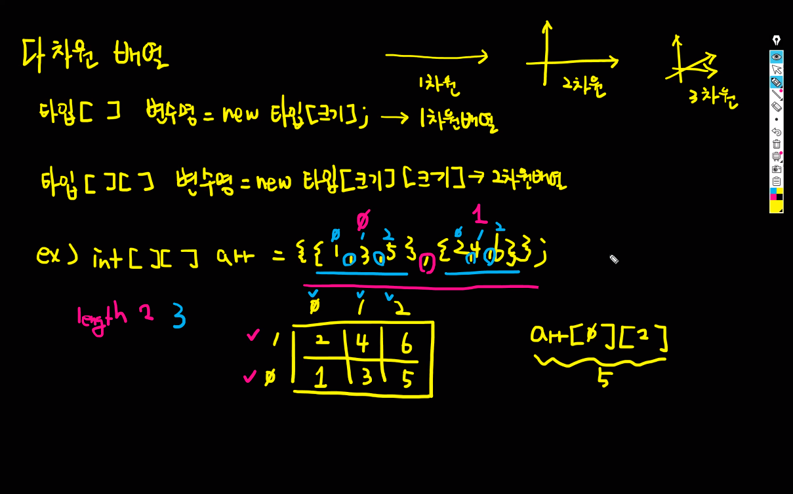
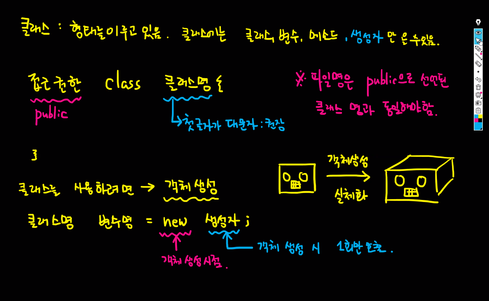
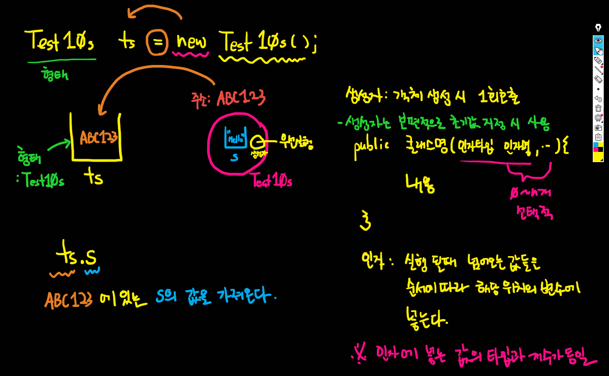
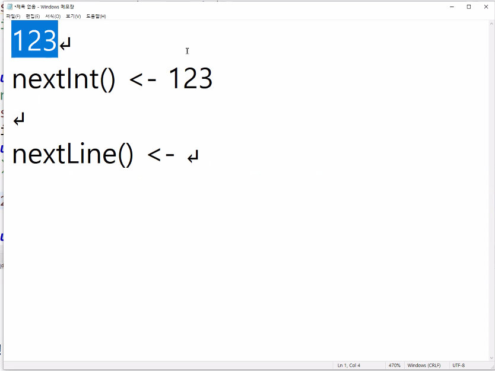

## 목차
- [목차](#목차)
- [1. 다차원 배열](#1-다차원-배열)
- [2. 클래스(Class)](#2-클래스class)
- [3. 메소드(method) : 기능(동작을 정의)](#3-메소드method--기능동작을-정의)
- [4. Life-cycle](#4-life-cycle)
- [5. Scanner](#5-scanner)
 
---

## 1. 다차원 배열

1차원은 x축 / 2차원은 x, y축 / 3차원은 x, y, z축



- 아래처럼 만들면 배열을 나타내는 칸이 하나만 있으니까 1차원 배열이라고 부름.

```java
타입[] 변수명 = new 타입[크기];
```

- 2차원 배열

```java
타입[][] 변수명 = new 타입[크기][크기];
```

3차원 배열을 쓰게 되는 경우는 특수한 상황을 제외하고는 웹 상에서는 거의 없다. (3D를 그릴 때 빼고는 없다.)

```java
ex) int [][] arr = {{1, 3, 5}, {2, 4, 6}}
```

'몇 동, 몇 호다' 라고 이해하면 쉬움. 일반적으로 2차원 배열까지는 표로 그려보면 이해하기 쉬움.

다차원 배열은 값을 조금 더 체계적으로 여러개 놓고 싶다 할 때 놓는 것.

<br/>

## 2. 클래스(Class)

**클래스** : 형태를 이루고 있다. 클래스에는 클래스, 변수, 메소드 + 생성자 만 올 수 있음.



```java
접근권한 class 클래스명 {

}
```

접근권한 public : 어디서나 사용 가능하다. 오픈 되어있는 접근 권한을 말함.

***제한 사항 : 파일명은 public으로 선언된 클래스명과 동일해야 한다.** (파일명과 클래스명이 동일하게 만들어지기 때문.)

클래스명 → **첫 글자가 대문자 : 권장**

소문자로 써도 상관은 없는데, 클래스, 메소드, 변수와 명확하게 구분하기 위해서 **첫 글자 대문자**로. 

**클래스를 사용하려면** : 객체 생성이 필요함.

**객체를 생성하려면 : 클래스명 변수명 = new 생성자;**

**객체 생성** : 실체화. 실제 동작하는 것을 설계도를 기반으로 만드는 것.  클래스가 동작하는 것이 아니라 객체가 동작하는 것임.

**자바에서 객체 생성 시점** : new가 호출될 때.

(new를 사용하는 배열은 객체라고 부를 수 있다.)



```java
Test10s ts = new Test10s();
```

ts 에는 Test10s 라는 형태만 들어올 수 있다. 형태를 지정해 놓은 것임. new는 객체 생성 시점. new 호출 되면서 객체를 만듦. 변수 ts 에는 실제로 저장되는 것은 주소임.

ts.s → ts는 ABC123이라는 주소가 들어있음. ABC123에 있는 s의 값을 가져온다.

생성자 : 객체 생성시 1회 호출 → 스마트폰 처음 샀을 때, 초기 설정하는 것과 동일. (생성자는 보편적으로 초기값 지정시 사용)

```java
public 클래스명(인자타입 인자명, ...) {
내용
}
```

인자(arguments) - 실행될 때 넘어오는 값들을 순서에 따라 해당 위치의 변수에 넣는다. 인자에 넣는 값의 타입과 개수가 동일해야함. 

넘겨주는 입장에서는 parameter(매개변수)라고 말하고, 받는 입장에서는 arguments(인자)라고 말함. 입장적인 차이에서 발생하는 용어 차이. 

생성자는 클래스명과 동일. 인자가 아무것도 없는 생성자는 기본 생성자.

<br/>

## 3. 메소드(method) : 기능(동작을 정의)

자바가 클래스로 이뤄져있고, 클래스 안에서 내부적으로 동작하는 것은 메소드. 본격적으로 자바를 동작하는 것은 메소드.

```java
접근권한 반환타입 메소드명(인자타입 인자명, ... ) {
내용
* 단, 반환타입이 void가 아니면
return 값;
}
```

접근권한 → 이걸 누가 사용할 것인가를 지정.

반환타입 → 메소드 실행 후 해당 위치에 돌려줄 값의 형태

*null과 void

null : 공간은 있으나 값이 없는 것.

void : 공간도 없고 값도 없는 것.

메소드명 → 내용에 해당하는 것을 보편적으로 채용. 영문으로 시작. 특문X

메소드명을 정할 때, 만든 내용에 맞춰서 쓰기.

인자는 0~n개 선택적

생성자와 메소드의 가장 큰 차이는 반환타입이 있는지 없는지.

<br/>

## 4. Life-cycle


***파란색 a는 클래스 전체에서 사용 가능, 초록색 a는 메소드 안에서만 사용 가능. (+ for문에서 선언된 변수도 for문 안에서만 사용 가능.)

```java
public class 클래스명 {
		int a = 10;

		public void 메소드1() {
				int a = 3;
				System.out.println(this.a); // this 는 해당 클래스.
		}

		public void 메소드2() {
				for(int i=0; ~~~) {
				}

		}
}
```

메소드 안에서 선언된 변수는 메소드 안에서만 사용 가능하고, 클래스에서 선언된 변수는 클래스 전체에서 사용할 수 있다

- **변수**
    - 전역변수 : 전체 영역, 클래스
    - 지역변수 : 특정 영역, 메소드

* 전역 변수와 지역 변수는 생존 가능한 범위에서 동일한 명칭 사용이 가능. 단, 각 영역별 1개씩만 존재 가능.

** 전역 변수와 지역 변수가 동일 명칭일 경우 사용시 가장 가까운 것(지역 변수)을 사용한다. 그래서 this(해당 클래스를 나타냄) 를 사용해서 전체 변수를 사용함. 전역 변수는 파란색 / 지역 변수는 갈색으로 표시됨.

<br/>

## 5. Scanner

```java
Scanner sc = new Scanner(System.in);
String input = sc.nextLine();
System.out.println(input);
```

**nextLine()** → 입력이 들어올 때까지 대기한다. 엔터로 구분.

**nextInt()** → 입력된 숫자를 정수로 받는다. 띄어쓰기로 구분. 

**next()** → 입력된 문자열 단어를 받는다. 띄어쓰기로 구분

next 계열의 대부분은 띄어쓰기로 구분.



*** 엔터는 남기고 숫자만 취득해서 엔터가 뒤로 넘어가서 입력하지 않았는데 출력하게 됨.