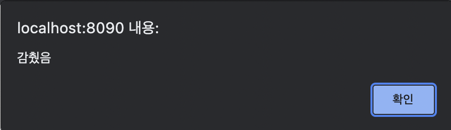

## 목차
- [목차](#목차)
- [.attr()](#attr)
- [.prop()](#prop)
- [.each()](#each)
- [fadeIn & fadeOut](#fadein--fadeout)

## .attr()

- 속성을 나타낸다.

```jsx
$("#box").on("click", function() { // id가 box인 객체에 click 이벤트 발생 시
	console.log($(this).attr("class")); // console에 box 객체의 class 속성을 취득
	$(this).attr("class", "blue"); // box 객체의 class 속성을 blue로 변경
});
```

- `.removeAttr()` : 속성을 제거함


## .prop()

- 상태를 나타낸다
- 대표적인 상태 - `checked, selected, disabled, readonly` 등
    - 상태가 양자택일로 이뤄져있다. true 아니면 false.
- is(selector) : 상태를 확인하는 것
    - 예를 들어 `:checked` 셀렉터라는 것이 있는데. `is(":checked")` 는 체크 되었는지 확인하는 것임.

```jsx
$("#btn").on("click", function() { // id가 btn인 객체 클릭하면 함수 실행
		// 속성이 아니라 상태를 바꾸려면 attr이 아닌 prop 써야함.
 		// if($("[name='cb']").prop("checked")) { 
    // is 사용해서 상태를 확인할 수도 있음.
		if($("[name='cb']").is(":checked")) {
			$("[name='cb']").prop("checked", false);
		} else {
			$("[name='cb']").prop("checked", true);
		}
		// '버튼'을 클릭할 때도 체크해준다. 선택이 된 개수 체크. 개수도 length로 가능.
		$("#txt").val($("[name='cb']:checked").length);
});
```


## .each()

- `.each()` : 내가 찾은 셀렉터에 대해서 각각 뭔가를 해주겠다.
- `each` : 해당 객체를 하나씩 꺼내서 함수 실행
- `$(this)` 를 통하여 객체 취득

```jsx
$("[name='cb']").on("change", function() {
	// name이 cb인 객체가 체크되어 있는 수를 id가 txt인 객체의 value에 할당
	$("#txt").val($("[name='cb']:checked").length);
	
	// name이 cb인 객체가 체크되어 있는 객체를 하나씩 꺼내서 함수 실행하겠다.
	$("[name='cb']:checked").each(function() {
		console.log("checked : " + $(this).val());
	});
});
```


## fadeIn & fadeOut

- `fadeIn`과 `fadeOut`은 display : none 까지 겸하고 있다.
- 사라지고 생기는 시간은 기본적으로 0.4초. 시간은 밀리세컨 단위 사용. 또는 “fast”, “slow” 같은 값 사용 가능.
- `.동작행위(시간, 함수);`
    - 시간 : 해당 시간만큼 동작을 수행.
    - 함수 : 해당 동작 완료 후 실행.
- fadeIn 예시

```jsx
$("#hideBtn").on("click", function() { // id가 hideBtn인 객체를 클릭하면 함수 실행
	$("#box").fadeOut("fast", function() {
		// 사라지고 나서 "감췄음" 이라는 경고창이 뜸
		alert("감췄음");
	});
	// $("#box").hide(); : 해당 객체를 곧바로 숨겨줌
});
```





- fadeOut 예시

```jsx
$("#showBtn").on("click", function() {
	// 해당 객체를 fadeIn으로 보여줌. 시간 또는 기본값으로 설정 가능
	$("#box").fadeIn("slow");
	// $("#box").show(); : 해당 객체를 곧바로 보여줌
});
```

