## 목차
- [목차](#목차)
- [Spring 설치](#spring-설치)
- [Spring 기본 구조](#spring-기본-구조)

## Spring 설치 

- 이클립스 마켓플레이스 - 플러그인 다운로드
    - Help → Eclipse Marketplace
    
    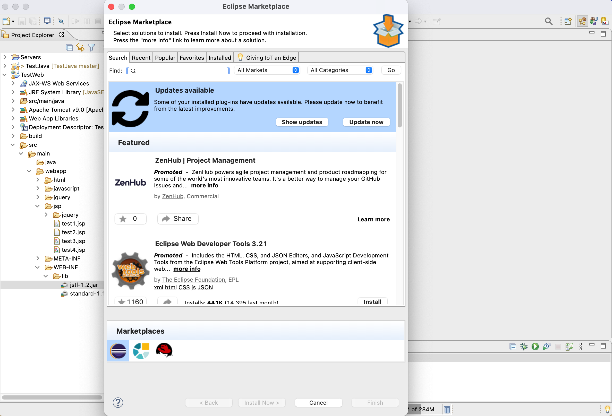
    
1. sts 검색
2. Spring Tools 3 (Standalone Edition) 설치
    
    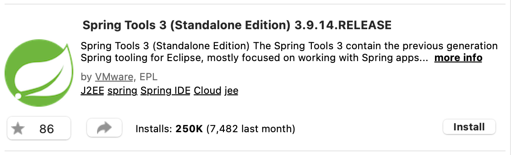
    
3. Spring Dashboard 체크 해제
    
    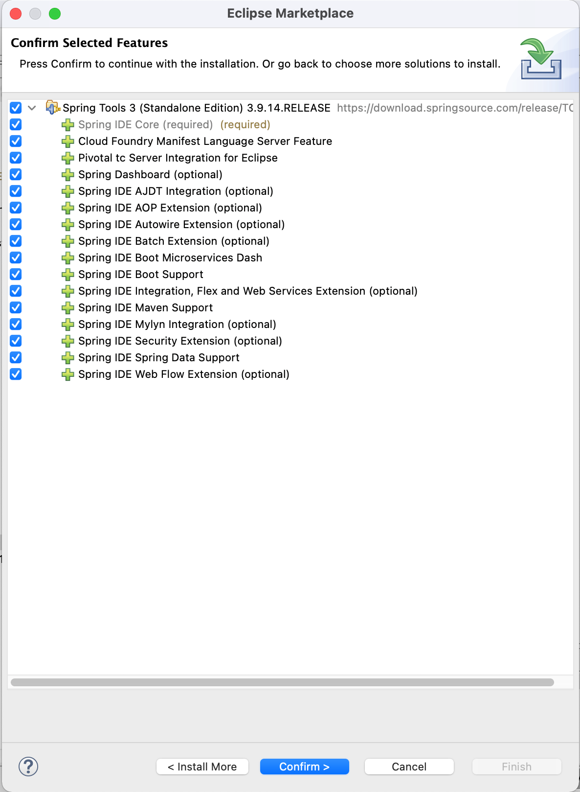
    
4. Confirm 클릭
5. 약관 동의하기
    
    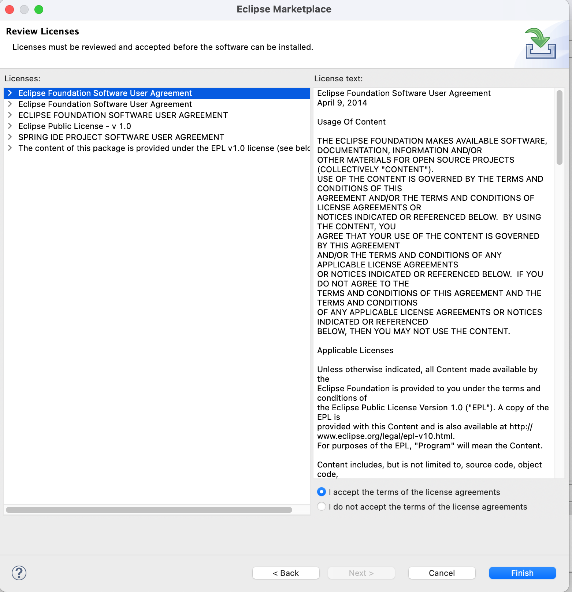
    
6. finish 클릭
7. 하단에 설치중 확인 가능
    
    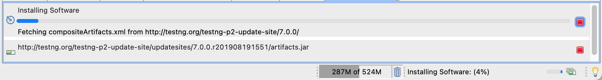
    

## Spring 기본 구조

- **Framework** : 틀. 특정 목적을 기준으로 개발에 필요한 구조와 필요 기능들을 미리 구현하여 방법을 제시하는 것
- 웹을 개발할 때 가장 기초 모델이 되는 것이 **MVC 모델**
    - **Model** - 데이터를 보관
    - **View** - 화면
    - **Controller** - 조작 및 관리


- **Java Web**

| Model1 | Model2 | Framework |
| --- | --- | --- |
| MVC가 한 공간. M이 분리되기도 함. | MVC를 분리하기 시작 Custom Tag 활용 | 각 목적에 따라 Model2를 변화 |
- **Java Web Framework**

| Struts | 쉽게 개발하는 것이 목적. 소형 웹사이트에서 주로 사용.(타겟 대상의 숫자를 기준으로 소형, 대형을 나눌 수 있음) <br>1.x 버전 ~ 2.x 버전 - 쉽게  |
| --- | --- |
| Spring | 보안 강화, 안정성 중시. <br> 1.x 버전 - 보안 강화 <br>2.x 버전 - 구조적 개선 <br>2.5x 버전 - 쉽게 개발을 시도함. Struts를 벤치마킹함 Annotation 활용. <br>3.x 버전 - 쉽게. 코드의 양적 완화. <br>4.x 버전 - 쉽게. 호환성 강화. 합동 프로젝트 분리(Spring Boot, Spring Cloud, Spring Security 등) |


- **Spring 학습 시 주의사항**
    1. 흐름 파악이 우선
    2. 몸에 익힌다
    3. 이해
    
- **Spring 프로젝트 만들기**
    - 이클립스 Project Explorer에서 New → other → Spring → Spring Legacy Project → Next → project name은 TestSpring
    
    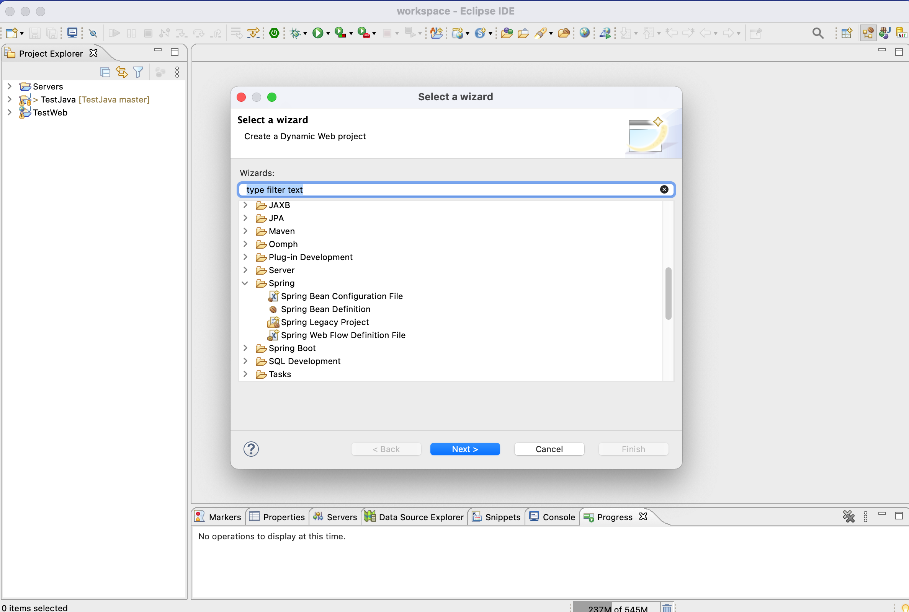
    
    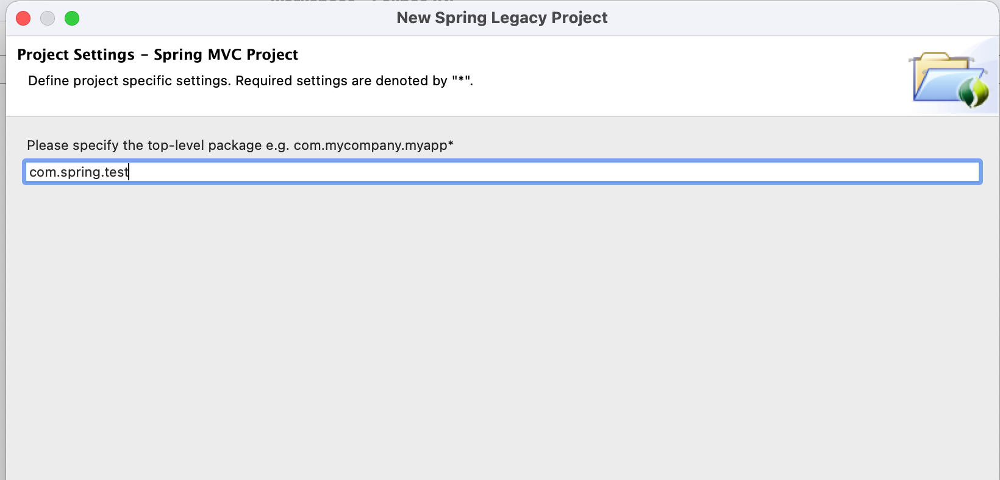
    

- **Spring 기본 폴더 구조**
    
    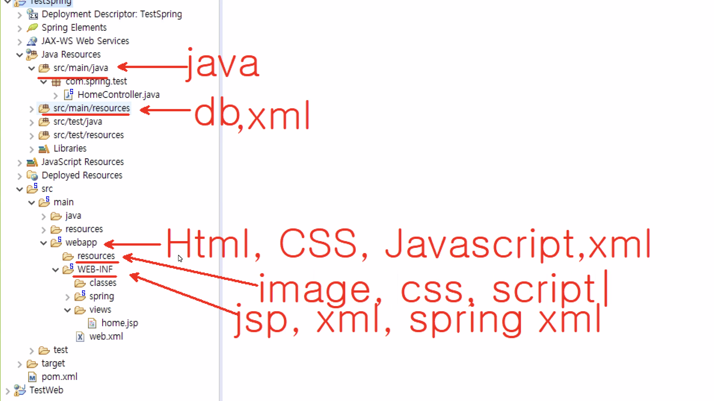
    
    - 우리가 써야할 것이 기본 분할이 되어있다. 관리 포인트를 나눠놓은 것이다.
    - WEB-INF에 lib 폴더 말고 다른 것들이 들어와있다. 여기에는 jsp, xml, spring xml이 들어가있다.
    - image, css, script는 resources 폴더에 들어감.

pom.xml 누르면 **Maven**이 나옴.

- **Maven - 통합 라이브러리 관리 및 배포지원** - jstl, standard 등 라이브러리 직접 넣을 필요 없어짐.
    - [https://mvnrepository.com/](https://mvnrepository.com/) → dependency 제공 사이트
        - 필요한 라이브러리를 <dependency> 태그 활용해서 넣으면 됨.
    - sprigframework-version 4.3.18로 바꾸기
        
        ```java
        <org.springframework-version>4.3.18.RELEASE</org.springframework-version>
        ```
        
    - java 11버전으로 바꾸기
        
        ```java
        <java-version>11</java-version>
        ```
        
    - 저장 누르면 자동으로 업데이트 됨.
    - JRE System Library의 자바 버전 바꾸는 방법
        
        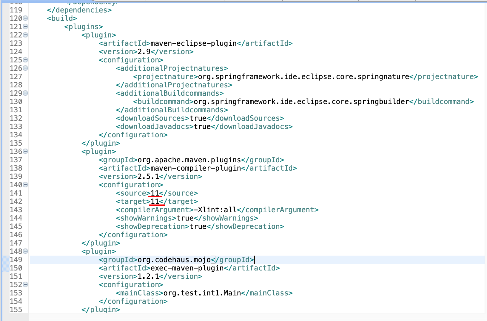
        

- **web.xml** - 웹 프로젝트 설정 파일
    
    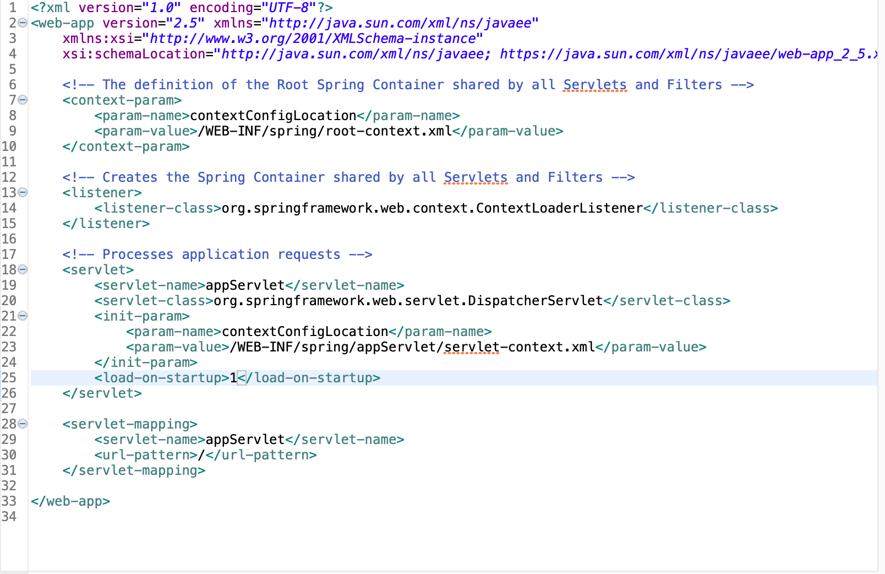
    
    
    **web.xml**
    
    - Servlet 구현
        - 주소 → 서블릿 구동 `(**(개발영역)** → 주소에 따른 행위 구현 → 띄울 화면JSP 지정 → 서블릿에 전달)` → JSP 실행 → HTML 전달
    - `load-on-startup` - 실행할 때 몇 번째로 실행할 것인가.
    - `servlet-mapping` - 해당 주소를 거쳐오는 모든 내용을 서블릿에 연결하겠다.

- **servlet-context.xml**
    
    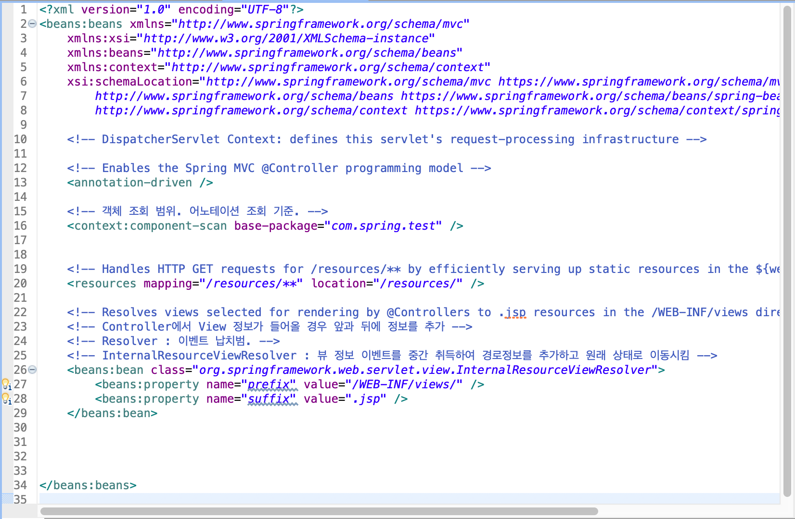
    
    - `xml` : html은 화면을 어떻게 그릴 것인가에 대한 것이라면 xml은 데이터를 어떻게 보낼 것인가에 대한 것.
    - `annotation-driven` : 어노테이션(@)을 기능으로 사용하겠다.
    - `<context:component-scan base-package=*"com.spring.test"* />` : 객체 조회 범위. 어노테이션 조회 기준.
    - Controller에서 View 정보가 들어올 경우 앞과 뒤에 정보를 추가
    - `Resolver` : 이벤트 납치범
    - `InternalResourceViewResolver` : 뷰 정보 이벤트를 중간 취득하여 경로정보를 추가하고 원래 상태로 이동시킴

- `Spring 서버 실행` : TestSpring 우클릭 → Run as → Run on Server → [localhost](http://localhost) → Tomcat → Finish

- `Controller` 역할 : 주소가 들어오면 해당 메소드를 실행하고 결과를 돌려준다.
    
    ```java
    package com.spring.test.controller;
    
    import org.springframework.stereotype.Controller;
    import org.springframework.web.bind.annotation.RequestMapping;
    import org.springframework.web.servlet.ModelAndView;
    
    // Controller 임을 작성
    @Controller
    public class TestController {
    	@RequestMapping(value = "/test1")
    	public ModelAndView testA(ModelAndView mav) {
    		// ViewResolver로 인하여 최종 위치정보는 다음과 같이 바뀜
    		// "/WEB-INF/views/" + "test/test1" + ".jsp"
    		mav.setViewName("test/test1");
    		
    		return mav; // Spring Servlet에 전달 
    	}
    
    }
    ```
    
    - `@RequestMapping` : 해당 주소와 아래 메소드를 연결한다.
    - `ModelAndView` : 데이터를 담으며, 화면 또는 화면 정보를 담을 수 있는 클래스. Model 클래스와 View 클래스를 합친 형태.
    - Spring에서 RequestMapping에 연결된 메소드의 경우 인자는 자동으로 넘어온다.(Spring에서 생성 후 제공)
    - `setViewName` : View(jsp)의 위치정보를 담는다.

- **Spring 한 싸이클 요약**

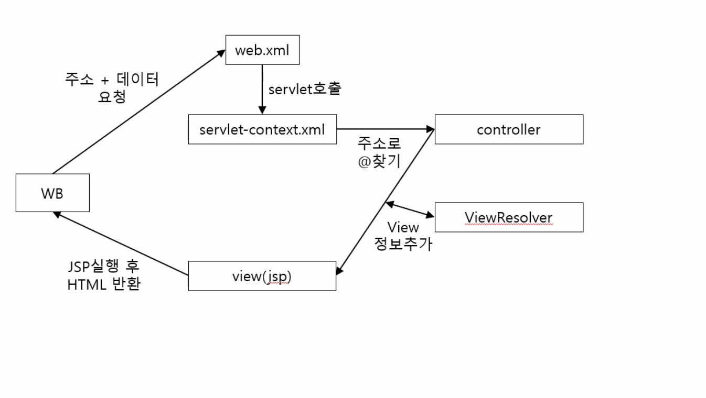

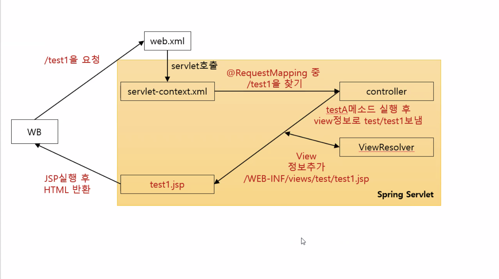