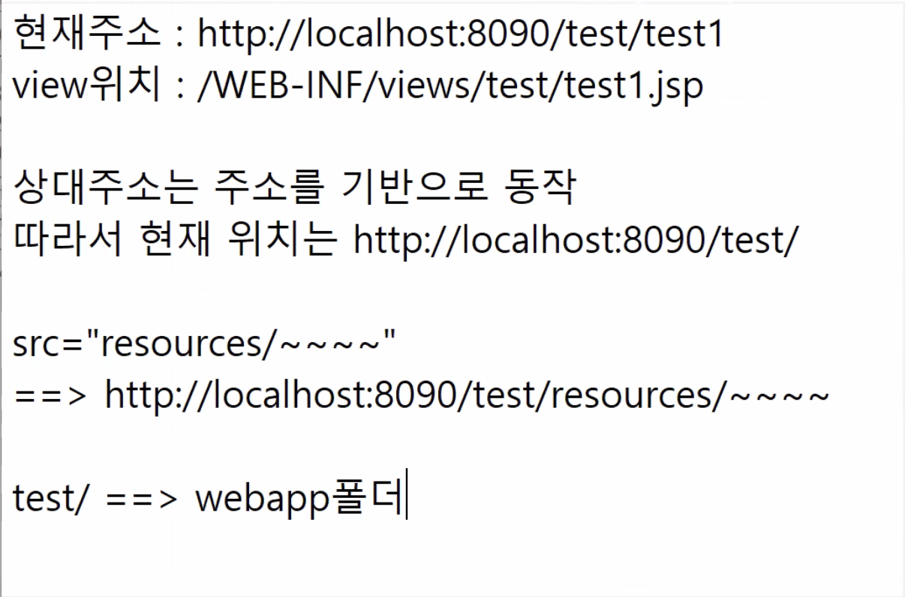
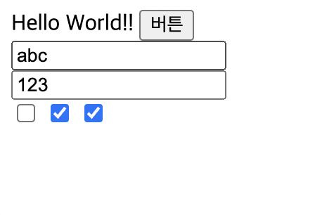
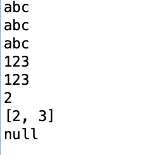
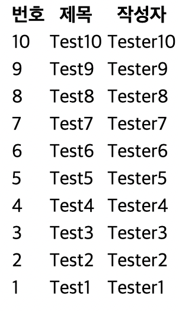

## 주소와 뷰는 다르다!



- `주소` : 사용자 요청사항
- `뷰` : 제공 항목

- servlet-context.xml - resources 경로로 접근하는 경우 resources 파일로 연결하겠다.
    
    ```java
    <resources mapping="/resources/**" location="/resources/" />
    ```
    
    - 따라서 test1.jsp 안에 `src=*"resources/jquery/jquery-1.12.4.js"`  는 webapp 폴더의 resources 폴더로 연결됨*
        
        ```java
        <script type=*"text/javascript"* src=*"resources/jquery/jquery-1.12.4.js"*></script>
        ```
        

## Controller에서 view에 값 전달

```java
public ModelAndView test2(HttpServletRequest req, ModelAndView mav) {
	mav.addObject("csend", "컨트롤러에서 보냄");
	req.setAttribute("rcsend", "컨트롤러에서 보냄2");
}
```

- `addObject(키, 값)` : 해당 키로 값을 view에 전달. Model의 기능
- `setAttribute(키, 값)` : 해당 키로 값을 view에 전달
- view에서 값 받기 - Controller에서 보낸 것은 param 없이 사용 가능
    - `${csend}`
    - `${rcsend}`
    
    
    

## Controller에서 요청 객체 데이터 받기

- test1.jsp
    
    ```java
    <%@ page language="java" contentType="text/html; charset=UTF-8"
        pageEncoding="UTF-8"%>
    <!DOCTYPE html>
    <html>
    <head>
    <meta charset="UTF-8">
    <title>Insert title here</title>
    <script type="text/javascript" src="resources/jquery/jquery-1.12.4.js"></script>
    <script type="text/javascript">
    $(document).ready(function() {
    	$("#btn").on("click", function() {
    		$("#sendForm").submit();
    	});
    });
    </script>
    
    </head>
    <body>
    Hello World!!
    <input type="button" value="버튼" id="btn" />
    <br>
    <form action="test2" id="sendForm">
    	<input type="text" name="msg" /><br>
    	<input type="text" name="msg2" /><br>
    	<input type="checkbox" name="cb" value="1" /> <!-- name이 같은 이유는 용도가 같기 때문 -->
    	<input type="checkbox" name="cb" value="2" />
    	<input type="checkbox" name="cb" value="3" />
    </form>
    </body>
    </html>
    ```
    
    
    
- TestController.java
    
    ```java
    	@RequestMapping(value = "/test2")
    	public ModelAndView test2(HttpServletRequest req,
    			@RequestParam String msg, 
    			@RequestParam(value = "msg") String s, 
    			@RequestParam HashMap<String, String> params, 
    			TestBean tb,
    			@RequestParam String cb, 
    			@RequestParam(value = "cb") ArrayList<String> list,
    			@RequestParam(required = false) String test,
    			ModelAndView mav) {
    
    		System.out.println(req.getParameter("msg"));
    		System.out.println(msg);
    		System.out.println(s);
    		System.out.println(params.get("msg2"));
    		System.out.println(tb.getMsg2());
    		System.out.println(params.get("cb"));
    		System.out.println(list.toString());
    		System.out.println(test);
    		
    		// Sample 데이터 만들기
    		List<HashMap<String, String>> board = new ArrayList<HashMap<String, String>>();
    		
    		for(int i = 10; i > 0; i--) {
    			HashMap<String, String> data = new HashMap<String, String>();
    			
    			data.put("no", Integer.toString(i));
    			data.put("title", "Test" + i);
    			data.put("writer", "Tester" + i);
    			
    			board.add(data);
    		}
    		mav.addObject("board", board);
    	}
    ```
    
    
    
    - `@RequestParam` : 요청에서 값을 받아온다. 변수명과 키가 같으면 값을 넣어줌.
    - `@RequestParam(name 또는 value)` : 키가 같으면 변수에 값을 넣어줌
    - @RequestParam에 `HashMap`이 오면 키와 값들을 자동 할당
    - `Bean`이 온 경우 이름이 일치하는 키와 값을 할당
        - Controller에서 Bean 클래스 데이터 받기
            1. com.spring.test 안에 bean 패키지 만들고 TestBean 클래스 만들기
            2. msg, msg2 변수 선언하고, Getter and Setter 생성
                
                ```java
                package com.spring.test.bean;
                
                public class TestBean {
                	private String msg;
                	private String msg2;
                	
                	public String getMsg() {
                		return msg;
                	}
                	public void setMsg(String msg) {
                		this.msg = msg;
                	}
                	public String getMsg2() {
                		return msg2;
                	}
                	public void setMsg2(String msg2) {
                		this.msg2 = msg2;
                	}	
                }
                ```
                
            3. TestController.java에서 메소드 안에 TestBean tb 넣기
- 문자열로 받을 경우에 복수의 데이터가 같은 이름인 경우 `,`로 구분하여 들어옴. 그 외에는 처음 것만.
- 복수의 데이터를 리스트나 배열로 받으면 차례대로 추가한다.
    - `items` : 순차데이터를 하나씩 꺼내서 가져온다. 향상된 for문하고 똑같다.
    - test2.jsp
        
        ```html
        <table>
        	<thead>
        		<tr>
        			<th>번호</th>
        			<th>제목</th>
        			<th>작성자</th>
        		</tr>
        	</thead>
        	<tbody>
        		<c:forEach var="data" items="${board}">
        			<tr>
        				<td>${data.no}</td>
        				<td>${data.title}</td>
        				<td>${data.writer}</td>
        			</tr>
        		</c:forEach>
        	</tbody>
        </table>
        ```
        
        
        
- `required` : 필수 여부. 키가 넘어오지 않는 경우 문제가 발생하기에 옵션을 지정한다. 기본값은 `required = true`
- `getParameter(키)` : 요청 객체에서 키에 해당하는 값을 가져온다.