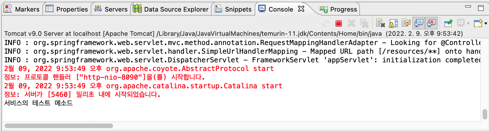
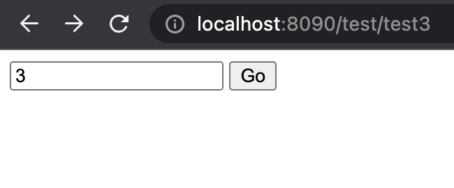
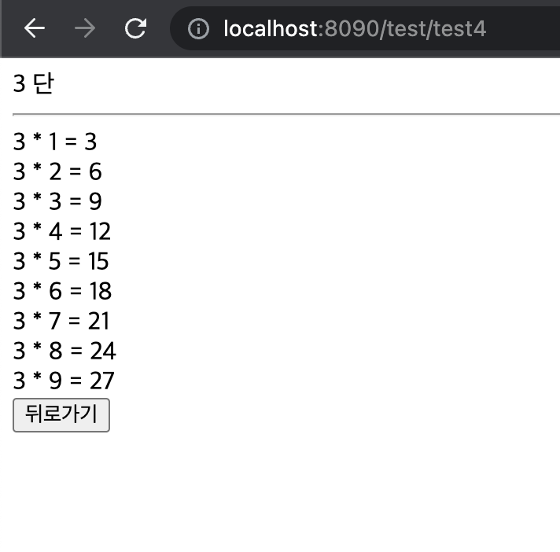

## DI(Dependency Injection) - 의존성 주입

- 의존성 주입 - 스프링을 관통하는 핵심적인 개념
    - Spring에서 사용할 핵심 클래스들은 Spring에서 객체를 생성한다. (ex. Controller의 객체를 생성하지 않아도 스프링이 생성해준다.)
    - Spring 구동 → 파일 조회 → @어노테이션 기반으로 객체 생성 → DI 발생 → 등등...
        - 객체 생성과 DI 발생의 순서는 왔다갔다함.
- 의존성 주입(DI) 이란?
    - 객체를 사용하기 위하여 미리 만들어진 객체를 Spring에서 주입 시켜 주는 행위
    - 스프링 2.x 까지는 객체 정보 및 의존성 주입을 xml 에서 지정 (클래스를 하나 만들 때마다 bean을 일일이 등록함.)
    - 스프링 2.5~ 부터는 Spring이 자동관리. 요청만 하면 됨.
- 의존성 주입 과정
    1. Controller에서 사용 요청
    2. 인터페이스명이 동일한 것을 확인
    3. 해당 인터페이스를 참조하고 있는 클래스 객체 취득
    4. 주입

- DI에서의 Interface = 이름표!

- ITestService 인터페이스 & TestService 클래스 만들고 TestController에서 사용 요청하기
    - ITestService 인터페이스
        
        ```java
        package com.spring.test.service;
        
        public interface ITestService {
        
        	public void test();
        	
        }
        ```
        
    - TestSerivce 클래스
        
        ```java
        package com.spring.test.service;
        
        import org.springframework.stereotype.Service;
        
        @Service
        public class TestService implements ITestService{
        
        	@Override
        	public void test() {
        		System.out.println("서비스의 테스트 메소드");
        		
        	}
        
        }
        ```
        
    - TestController
        - `@Autowired` : 아래 지정된 인터페이스를 찾아서 객체 주입
        
        ```java
        @Autowired
        **public** ITestService iTestService;
        ```
        
        ```java
        @RequestMapping(value = "/test3")
        	public ModelAndView test3(ModelAndView mav) {
        		
        		// test() 메소드 호출
        		iTestService.test();
        
        		mav.setViewName("test/test3");
        		
        		return mav;
        	}
        ```
        

- test3.jsp 만들고 서버 실행 후 [http://localhost:8090/test/test3](http://localhost:8090/test/test3) 들어가면 이클립스 콘솔창에 `서비스의 테스트 메소드` 출력됨.
    
    
    

## DI 활용해 구구단 출력 실습

- TestController.java - test3.jsp 에서 test4.jsp로 넘어갈 때(요청) dan 값을  `@RequestParam int dan` 통해 가져옴
    
    ```java
    public class TestController {
    	
    	// @Autowired : 아래 지정된 인터페이스를 찾아서 객체 주입
    	@Autowired
    	public ITestService iTestService;
    
    	@RequestMapping(value = "/test4")
    	public ModelAndView test4(@RequestParam int dan, // dan 값 취득
    														ModelAndView mav) { 
    		
    		// 서비스 호출하여 구구단 결과 취득
    		String result = iTestService.gugudan(dan);
    		
    		// 취득한 데이터 화면에 전송
    		mav.addObject("gugu", result);
    		
    		mav.setViewName("test/test4");
    		
    		return mav;
    
    	}
    
    }
    ```
    

- ITestService.java
    
    ```java
    package com.spring.test.service;
    
    public interface ITestService {
    	
    	public String gugudan(int dan);
    
    }
    ```
    

- TestService.java - ITestService를 구현해서 메소드 오버라이딩
    
    ```java
    package com.spring.test.service;
    
    import org.springframework.stereotype.Service;
    
    @Service
    public class TestService implements ITestService{
    
    	@Override
    	public String gugudan(int dan) {
    		String result = "";
    		for(int i = 1; i < 10; i++) {
    			result += dan + " * " + i + " = " + dan * i + "<br>";	
    		}
    		return result;
    	}
    }
    ```
    

- test3.jsp
    
    
    
    ```java
    <%@ page language="java" contentType="text/html; charset=UTF-8"
        pageEncoding="UTF-8"%>
    <!DOCTYPE html>
    <html>
    <head>
    <meta charset="UTF-8">
    <title>Insert title here</title>
    <script type="text/javascript" src="resources/jquery/jquery-1.12.4.js"></script>
    <script type="text/javascript">
    $(document).ready(function() {
    	$("#goBtn").on("click", function() {
    		if($.trim($("#dan").val()) == "") {
    			alert("입력하세요.");
    			$("#dan").focus();
    		} else if(isNaN($("#dan").val() * 1)) {
    			alert("숫자를 입력하세요.");
    			$("#dan").val("");
    			$("#dan").focus();
    		} else {
    			$("#sendForm").submit();
    		}
    	});
    });
    </script>
    </head>
    <body>
    <form action="test4" id="sendForm" method="post">
    	<input type="text" id="dan" name="dan">
    	<input type="button" value="Go" id="goBtn">
    </form>
    </body>
    </html>
    ```
    

- test4.jsp
    
    
    
    ```java
    <%@ page language="java" contentType="text/html; charset=UTF-8"
        pageEncoding="UTF-8"%>
    <!DOCTYPE html>
    <html>
    <head>
    <meta charset="UTF-8">
    <title>Insert title here</title>
    <script type="text/javascript" src="resources/jquery/jquery-1.12.4.js"></script>
    <script type="text/javascript">
    $(document).ready(function() {
    	$("#backBtn").on("click", function() {
    		history.back();
    	});
    });
    </script>
    </head>
    <body>
    ${param.dan} 단<br>
    <hr>
    ${gugu}
    <input type="button" id="backBtn" value="뒤로가기">
    </body>
    </html>
    ```
    

- DI에서 인터페이스를 쓰는 이유 - **느슨한 관계를 만들기 위해**. 한 객체에 문제가 터져도 다른 객체들은 동작하게 한다. 스프링이 추구하는 것은 **안정성**과 **보안 유지**기 때문에 인터페이스를 사용해 안정적이고 보안이 잘 되도록 한다.
    
    
    - 초기버전(문제 없을 경우)
        - Controller 컴파일 클래스
        - Service 컴파일 클래스
    - 컴파일 중 문제 발생(인터페이스일 경우)
        - Controller 컴파일 클래스
        - Service 컴파일 클래스 **생성 안됨**.
    
- 인터페이스 안 쓰고 클래스를 직접 연결할 경우
    - 초기버전(문제 없을 경우)
        - Controller 컴파일 클래스
        - Service 컴파일 클래스
    - 컴파일 중 문제 발생(클래스 직접 연결한 경우)
        - Controller 컴파일 클래스 **생성 안됨**.
        - Service 컴파일 클래스 **생성 안됨**.