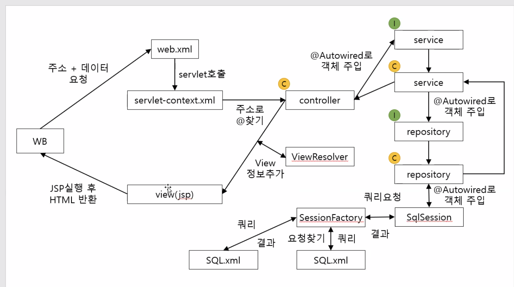

## 게시판 목록 만들어 DB와 연결

- TestService에서 @Autowired 만들고 ITestDao 인터페이스 변수 선언 - @Autowired로 객체 주입

- TestController에서 @Autowired 만들고 ITestService 인터페이스 변수 선언 - @Autowired로 객체 주입

- 쿼리가 저장되는 곳은 SQL.xml 이다. Blank_SQL.xml 복사해서 Test_SQL.xml 만들기.
    - `mapper`는 클래스 같은 것. 쿼리 하나하나를 메소드라고 봤을 때, 쿼리를 관리하려고 만들어 놓은 것이 mapper.
    - `namespace` : 클래스명 같은 것.
    - `id` : 메소드명과 동일
    - `resultType` : 취득할 데이터 row의 형태를 지정
    - 쿼리 부분에 ;은 포함되면 안 된다.

- SQL Developer 에서 샘플 테이블 만들기

- 이클립스 TestController에서 주소 연결
    - 화면에 데이터 뿌려줄 것임.
    - 외부에 있는 데이터를 연결할 때에는 무조건적으로 예외처리가 필요함. DB사용시 예외처리 필수
        - 데이터베이스 서버가 죽을 수도 있고, 외부적인 요인으로 오라클과 연결이 안될 때가 있다. 문제가 발생할 수 있다.
        - throws throwable 하는 게 기본
    - Controller → Service → Dao 순서로 외부 데이터를 연결

- Controller에서 iTestService에 getTblist() 메소드 요청
    
    ```java
    	@Autowired
    	public ITestService iTestService;
    
    	@RequestMapping(value = "/tbList")
    	public ModelAndView tbList(ModelAndView mav) throws Throwable {
    		List<HashMap<String, String>> list = iTestService.getTbList();
    		mav.addObject("list", list);
    		mav.setViewName("test/tbList");
    		return mav;
    	}
    
    ```
    

- ITestService에서 getTbList() 메소드 만든다.

- TestSerivce는 ITestService를 참조하고 getTbList() 메소드를 오버라이딩 함.  ITestDao에 getTbList() 메소드 요청
    
    ```java
    	@Autowired
    	public ITestDao iTestDao;
    	
    	@Override
    	public List<HashMap<String, String>> getTbList() throws Throwable {
    		return iTestDao.getTbList();
    	}
    
    	
    ```
    

- ITestDao에서 getTbList() 메소드 만든다.

- TestDao는 ITestDao를 참조하고 getTbList() 메소드를 오버라이딩 함.
    - 목록을 받을 때에는 selectList 사용
    
    ```java
    	@Override
    	public List<HashMap<String, String>> getTbList() throws Throwable {
    		// selectList(SQL 위치) : 위치에 있는 SQL을 조회하여 목록을 취득하겠다.
    		// SQL 위치 : namespace.id
    		return sqlSession.selectList("test.getTbList");
    	}
    ```
    
    - sqlSession에 쿼리 실행 결과를 요구함. test에 있는 getTbList 쿼리 실행 결과를 넘겨달라.

- .XML 에서 쿼리를 찾기 시작한다. namespace가 test, id가 getTbList 라는 것을 찾아서 결과를 HashMap으로 돌려준다. 하지만 TestDao에서는 리스트로 받기로 되어 있어서 리스트로 받게 됨.

- TestDao → ITestDao → TestService → ITestService → TestController 에서 list로 받게됨.

- 그리고 tbList.jsp에 list란 이름으로 넘겨줌

- tbList.jsp 에서는 반복문 활용해서 data로 꺼내 씀.
    
    ```html
    <table>
    	<thead>
    		<tr>
    			<th>번호</th>
    			<th>제목</th>
    			<th>작성자</th>
    			<th>작성일</th>
    			<th>조회수</th>
    		</tr>
    	</thead>
    	<tbody>
    		<c:forEach var="data" items="${list}">
    			<tr>
    				<td>${data.TB_NO}</td>
    				<td>${data.TB_TITLE}</td>
    				<td>${data.TB_WRITER}</td>
    				<td>${data.TB_DT}</td>
    				<td>${data.TB_HIT}</td>
    			</tr>
    		</c:forEach>
    	</tbody>
    </table>
    ```
    

## 상세보기 페이지 만들기

상세보기란 데이터 한 건에 대해 화면에 표현하는 것.

한 건을 기준 짓는 것은 글 번호. 특정 글 번호의 데이터를 가져오면 그 한 건에 대한 정보를 가져올 수 있음.

글 번호 : no

- no 를 담아서 보낼 것이 필요하기 때문에 `<tr no="${data.TB_NO}">` 추가해줌
    
    ```html
    	<tbody>
    		<c:forEach var="data" items="${list}">
    			<tr>
    				<td>${data.TB_NO}</td>
    				<td>${data.TB_TITLE}</td>
    				<td>${data.TB_WRITER}</td>
    				<td>${data.TB_DT}</td>
    				<td>${data.TB_HIT}</td>
    			</tr>
    		</c:forEach>
    	</tbody>
    ```
    

- 그리고 hidden을 form 안에 만든다. - hidden에 값을 담아서 보내야 내가 보고 싶은 글을 알려주게 됨.
    
    ```html
    <!-- action, href에서의 #은 이동하지 않겠다. -->
    <form action="#" id="actionForm" method="post">
    	<input type="hidden" id="no" name="no" />
    	<select id="searchGbn" name="searchGbn">
    		<option value="0">제목</option>
    		<option value="1">작성자</option>			
    	</select>
    
    	<input type="text" name="searchTxt" id="searchTxt" />
    	<input type="button" value="검색" id="searchBtn" />
    </form>
    ```
    

- tbody의 tr을 클릭했을 때 #no의 value에 내가 누른 tr의 속성no를 넣는다.
    - 그리고 #actionForm의 action에 tb를 넣어주고 이동
    
    ```jsx
    	$("tbody").on("click", "tr", function() {
    		$("#no").val($(this).attr("no"));
    		
    		$("#actionForm").attr("action", "tb");
    		$("#actionForm").submit();
    	});
    ```
    

- 새로운 주소 tb가 생겼으므로 컨트롤러로 이동.
    
    ```jsx
    	@RequestMapping(value = "/tb")
    	public ModelAndView tb(@RequestParam HashMap<String, String> params,
    							ModelAndView mav) throws Throwable {
    		
    		HashMap<String, String> data = iTestService.getTb(params);
    		
    		mav.addObject("data", data);
    		
    		mav.setViewName("test/tb");
    		
    		return mav;
    	}
    ```
    
    - 컨트롤러에 주소 매핑 후 iTestService에 getTb 메소드 요청

- iTestService에 getTb 메소드 만들기
- TestService에 getTb 메소드 오버라이딩
- iTestDao에 getTb 메소드 만들기
- TestDao에 getTb 메소드 오버라이딩하고 쿼리 요청
    
    ```jsx
    	@Override
    	public HashMap<String, String> getTb(HashMap<String, String> params) throws Throwable {
    		// selectOne(쿼리 위치) : 쿼리를 조회하여 한 건을 취득
    		// selectOne(쿼리 위치, 값) : 쿼리 조회 시 값을 전달하고 한 건을 취득
    		return sqlSession.selectOne("test.getTb", params);
    	}
    ```
    
- Test_SQL.xml 에서 쿼리 작성 - 쿼리 실행 결과는 단 건이므로 hashmap으로 받는다.
    - 글 번호를 받아서 사용해야하는데 값을 받아오는 것은 parameterType으로 사용.
    - dao에서 HashMap으로 값을 넘겨주기 때문에 여기서도 hashmap 사용.
    
    ```xml
    	<!-- #{키} : 키에 해당하는 값을 넣어준다. 앞뒤로 홑따옴표'' 붙임 -->
    	<!-- ${키} : 키에 해당하는 값을 넣어준다. 그냥 넣음. -->
    	<select id="getTb" resultType="hashmap" parameterType="hashmap">
    		SELECT TB_NO, TB_TITLE, TB_CON, TB_WRITER, TB_HIT, TO_CHAR(TB_DT, 'YYYY-MM-DD') AS TB_DT
    		FROM TB
    		WHERE TB_NO = #{no}
    	</select>
    ```
    

- 쿼리에서 받은 값을 컨트롤러로 가져와서 addObject 함.
    
    ```java
    	@RequestMapping(value = "/tb")
    	public ModelAndView tb(@RequestParam HashMap<String, String> params,
    							ModelAndView mav) throws Throwable {
    		
    		HashMap<String, String> data = iTestService.getTb(params);
    		
    		mav.addObject("data", data);
    		
    		mav.setViewName("test/tb");
    		
    		return mav;
    	}
    ```
    
- tb.jsp를 만들어서 컨트롤러에서 data로 보낸 값을 받아 화면으로 표현
    
    ```html
    <%@ page language="java" contentType="text/html; charset=UTF-8"
        pageEncoding="UTF-8"%>
    <%@ taglib prefix="c" uri="http://java.sun.com/jsp/jstl/core"%>
    <!DOCTYPE html>
    <html>
    <head>
    <meta charset="UTF-8">
    <title>TB</title>
    
    </head>
    <body>
    
    번호 : ${data.TB_NO}<br>
    제목 : ${data.TB_TITLE}<br>
    작성자 : ${data.TB_WRTIER}<br>
    작성일 : ${data.TB_DT}<br>
    조회수 : ${data.TB_HIT}<br>
    - 내용 -<br>
    ${data.TB_CON}
    </body>
    </html>
    ```