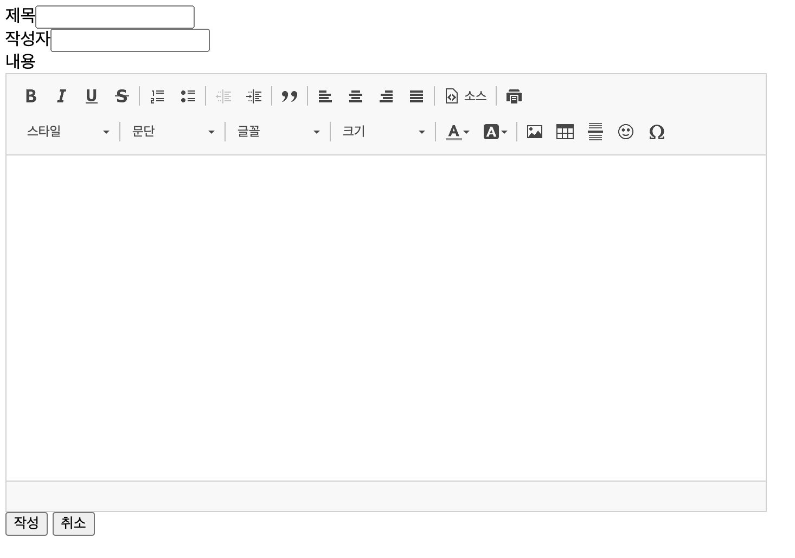
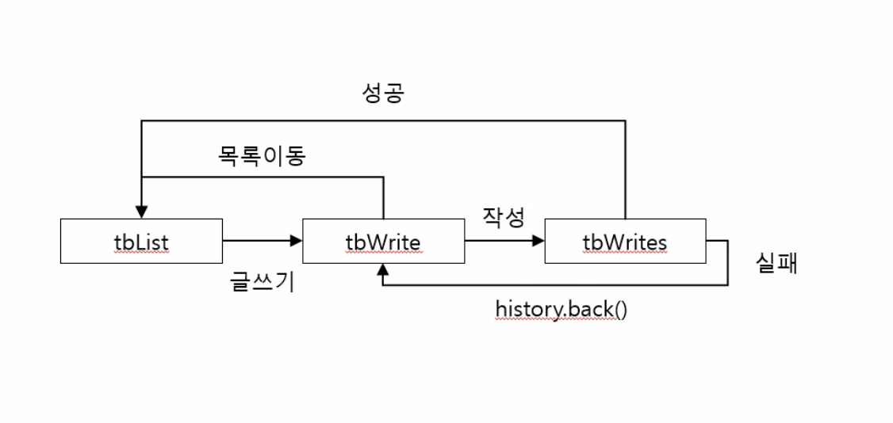

- 검색어 입력하고 난 뒤 셀렉트 박스 유지하는 것을 코어 태그로 대체하기

```java
if("${param.searchGbn}" != "") {
		$("#searchGbn").val('${param.searchGbn}');
	}
```

위 스크립트 대신에 아래 코어 태그로 대체 가능.

```html
	<select id="searchGbn" name="searchGbn">
		<c:choose>
			<c:when test="${param.searchGbn eq 1}">
				<option value="0">제목</option>
				<option value="1" selected="selected">작성자</option>			
			</c:when>
			<c:otherwise>
				<option value="0" selected="selected">제목</option>
				<option value="1">작성자</option>			
			</c:otherwise>
		</c:choose>
	</select>
```

## 검색창 버그 고치기

- 문제점 : 검색어를 치고 상세보기를 갔다가 돌아오면 쳐놓은 검색어로 검색이 되어있다.
- 해결 방법 : 검색 버튼 눌렀을 때만 데이터가 넘어가야 한다.
- <body>에 히든을 두 개 놓을 것.

```java
<!-- 검색 데이터 유지용 -->
<input type="hidden" id="oldSearchGbn" value="${param.searchGbn}">
<input type="hidden" id="oldSearchTxt" value="${param.searchTxt}">
```

- 검색어를 입력할 때만 입력된 값이 넘어가도록 하기 위해, 목록의 tr을 클릭하거나 페이징 버튼을 눌렀을 때는 기존에 받은 값을 사용하도록 아래 내용을 추가
    - `$("#searchGbn").val($("#oldSearchGbn").val());`
    `$("#searchTxt").val($("#oldSearchTxt").val());`

```java
	$("tbody").on("click", "tr", function() {
		$("#no").val($(this).attr("no"));
		
		$("#searchGbn").val($("#oldSearchGbn").val());
		$("#searchTxt").val($("#oldSearchTxt").val());
		
		$("#actionForm").attr("action", "tb");
		$("#actionForm").submit();
	});
	
	$("#paging_wrap").on("click", "span", function() {
		$("#page").val($(this).attr("page"));
		
		$("#searchGbn").val($("#oldSearchGbn").val());
		$("#searchTxt").val($("#oldSearchTxt").val());
		
		$("#actionForm").attr("action", "tbList");
		$("#actionForm").submit();
	});
```

## 글쓰기 기능 만들기

- tbList.jsp에서 글쓰기 버튼 만들기
    
    ```java
    <input type="button" value="글쓰기" id="writeBtn" />
    ```
    

- 클릭 이벤트 만들기
    
    ```java
    	$("#writeBtn").on("click", function() {
    		$("#searchGbn").val($("#oldSearchGbn").val());
    		$("#searchTxt").val($("#oldSearchTxt").val());
    		
    		$("#actionForm").attr("action", "tbWrite");
    		$("#actionForm").submit();
    	});
    ```
    
- 컨트롤러에 가서 메소드 만들기 - DB 연결할 필요 없으므로 예외 처리 하지 않아도 된다. jsp 만들러 가기
    
    ```java
    @RequestMapping(value = "/tbWrite")
    	public ModelAndView tbWrite(ModelAndView mav) {
    		mav.setViewName("test/tbWrite");
    		
    		return mav;
    	}
    ```
    

- tbWrite.jsp 만들기
    - 이전 페이지에서 넘어온 값 유지를 위한 form 만들기
    
    ```java
    <form action="tbList" id="backForm" method="post">
    	<input type="hidden" name="no" value="${param.no}">
    	<input type="hidden" name="page" value="${param.page}">
    	<input type="hidden" name="searchGbn" value="${param.searchGbn}">
    	<input type="hidden" name="searchTxt" value="${param.searchTxt}">
    </form>
    ```
    
    - 글쓰기 form 만들기
    
    ```java
    <form action="tbWrites" id="writeForm" method="post">
    제목<input type="text" id="title" name="title"><br>
    작성자<input type="text" id="writer" name="writer"><br>
    내용<br>
    <textarea rows="20" cols="50" id="con" name="con"></textarea>
    <input type="button" value="작성" id="writeBtn">
    <input type="button" value="취소" id="cancleBtn">
    </form>
    ```
    
    - script 추가
    
    ```java
    <script type="text/javascript" 
    				src="resources/script/jquery/jquery-1.12.4.min.js"></script>
    <script type="text/javascript">
    $(document).ready(function() {
    	$("#cancleBtn").on("click", function() {
    		$("#backForm").submit();
    	});
    
    	$("#writeBtn").on("click", function() {
    		if(checkEmpty("#title")) {
    			alert("제목을 입력하세요.")
    			$("#title").focus();
    		} else if(checkEmpty("#writer")) {
    			alert("작성자를 입력하세요.")
    			$("#writer").focus();
    		} else if(checkEmpty("#con")) {
    			alert("내용을 입력하세요.")
    			$("#con").focus();
    		} else {
    			$("#writeForm").submit();
    		}
    	});
    });
    
    function checkEmpty(sel) {
    	if($.trim($(sel).val()) == "") {
    		return true;
    	} else {
    		return false;
    	}
    }
    </script>
    ```
    
- tbWrites 라는 주소가 생겼으니 컨트롤러에서 메소드 추가

```java
	@RequestMapping(value = "/tbWrites")
	public ModelAndView tbWrites(@RequestParam HashMap<String, String> params,
							ModelAndView mav) throws Throwable {
		try {
			iTestService.tbWrite(params);
			
		} catch (Exception e) {
			e.printStackTrace();
		}
		
		
		return mav;
	}
```

- ITestService → TestSerivce → ITestDao → TestDao 메소드 만들고 재정의하기
    - 리턴값 없으므로 void로 써준다.

- TestDao 에서 추가
    - DB에 입력해야 하므로 insert를 사용함
    - `insert(~~)` : 등록 쿼리 실행

```java
	@Override
	public void tbWrite(HashMap<String, String> params) throws Throwable {
		// insert(~~) : 등록 쿼리 실행
		sqlSession.insert("test.tbWrite", params);
	}
```

- Test_SQL.xml 에서 insert 쿼리 추가. 데이터 받는 것 없으므로 `resultType`은 필요 없다.
    - 우리가 넘겨주는 params는 HashMap이기 때문에 parameterType은 `hashmap`

```java
	<insert id="tbWrite" parameterType="hashmap">
		INSERT INTO TB(TB_NO, TB_TITLE, TB_WRITER, TB_CON)
		VALUES(TB_SEQ.NEXTVAL, #{title}, #{writer}, #{con})
	</insert>
```

- [TestController.java](http://TestController.java) 에서 컨트롤러에서 컨트롤러로 이동하도록 만들기
    - `setViewName("redirect:주소")` : 해당 주소로 이동. 단, get 방식밖에 지원 안됨. 컨트롤러에서 컨트롤러로 이동한다.
    - 예외처리위해 try - catch 문 작성

```java
	@RequestMapping(value = "/tbWrites")
	public ModelAndView tbWrites(@RequestParam HashMap<String, String> params,
							ModelAndView mav) throws Throwable {
		
		try {
			iTestService.tbWrite(params);
			
			// setViewName("redirect:주소") : 해당 주소로 이동. 단, get 방식밖에 지원 안됨. 
																		// 컨트롤러에서 컨트롤러로 이동
			mav.setViewName("redirect:tbList");
			
		} catch (Exception e) {
			e.printStackTrace();
			mav.setViewName("test/tbWrites");
		}
		
		return mav;
	}
```

- 새로운 주소가 생겼으니 tbWrites.jsp 만들고 script 작성

```java
<script type="text/javascript">
alert("작성 중 문제가 발생했습니다.");
history.back();
</script>
```

## 에디터 만들기

- tbWrite.jsp 안에 ckeditor.js 넣어주기
    
    ```java
    <script type="text/javascript" 
    				src="resources/script/ckeditor/ckeditor.js"></script>
    ```
    
- script 안에
    
    ```java
    <script type="text/javascript">
    $(document).ready(function() {
    	CKEDITOR.replace("con", {
    		// 옵션
    		resize_enabled: false, // 크기 변경
    		language : "ko", // 언어
    		enterMode : 2, // 엔터<br>처리
    		width : "700", // 가로
    		height : "300" // 세로
    });
    ```
    

- `$(”#writeBtn”).on(”click”, function()` 안에 `$("#con").val(CKEDITOR.instances['con'].getData());` 추가
    - instances[이름] : 해당 이름으로 CKEDITOR 객체 취득
    - getData() : 입력된 데이터 취득
    
    ```java
    	$("#writeBtn").on("click", function() {
    
    		// instances[이름] : 해당 이름으로 CKEDITOR 객체 취득
    		// getData() : 입력된 데이터 취득
    		$("#con").val(CKEDITOR.instances['con'].getData());
    
    		if(checkEmpty("#title")) {
    			alert("제목을 입력하세요.")
    			$("#title").focus();
    		} else if(checkEmpty("#writer")) {
    			alert("작성자를 입력하세요.")
    			$("#writer").focus();
    		} else if(checkEmpty("#con")) {
    			alert("내용을 입력하세요.")
    			$("#con").focus();
    		} else {
    			$("#writeForm").submit();
    		}
    	});
    ```
    
    
    

post 방식인데 한글이 안 깨지는 이유는 서블릿에서 필터 설정을 해놓았기 때문이다.

- 글쓰기 기능 만들기 프로세스 요약
    
    