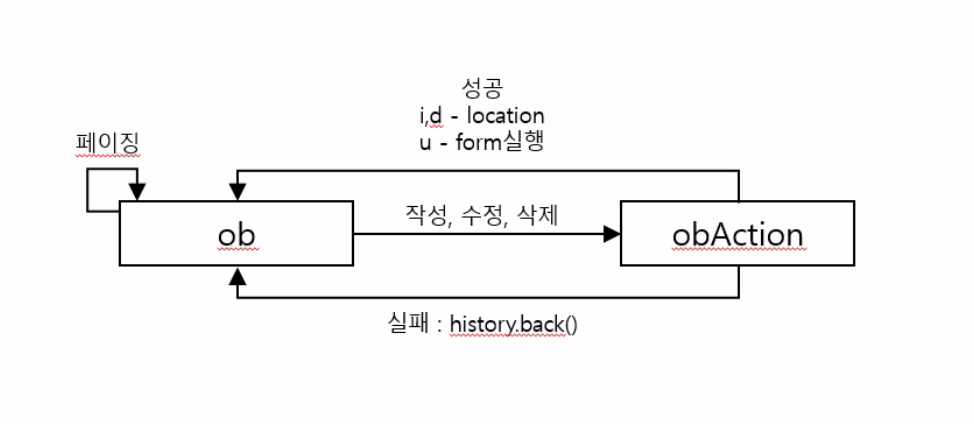

## 한 줄 게시판 만들기

- 새로운 DB 테이블 만들기
    
    
    

- DB 시퀀스 만들기
    
    
    

## 한 줄 게시판 목록 만들기

- ob.jsp 만들기
    - 코어 태그, 제이쿼리 붙이기

- body → 페이징 버튼 구현
    
    ```html
    <div id="pagingWrap">
    	<span page="1">처음</span>
    	<c:choose>
    		<c:when test="${page eq 1}">
    			<span page="1">이전</span>
    		</c:when>
    		<c:otherwise>
    			<span page="${page - 1}">이전</span>
    		</c:otherwise>
    	</c:choose>
    	<c:forEach var="i" begin="${pb.startPcount}" end="${pb.endPcount}" step="1">
    		<c:choose>
    			<c:when test="${page eq i}">
    				<span page="${i}"><b>${i}</b></span>
    			</c:when>
    			<c:otherwise>
    				<span page="${i}">${i}</span>
    			</c:otherwise>
    		</c:choose>
    	</c:forEach>
    	
    	<c:choose>
    		<c:when test="${page eq pb.maxPcount}">
    			<span page="${pb.maxPcount}">다음</span>
    		</c:when>
    		<c:otherwise>
    			<span page="${page + 1}">다음</span>
    		</c:otherwise>
    	</c:choose>
    	<span page="${pb.maxPcount}">마지막</span>
    </div>
    ```
    
- body → 작성 및 수정 영역 구현
    
    ```html
    <!-- 작성 및 수정 영역 -->
    <form action="#" id="actionForm">
    <input type="hidden" id="page" name="page" value="${page}">
    <input type="hidden" id="no" name="no">
    작성자<input type="text" id="writer" name="writer">
    내용<input type="text" id="con" name="con">
    <span class="write">
    <input type="button" value="작성" id="writeBtn">
    <input type="button" value="수정" id="updateBtn">
    <input type="button" value="취소" id="cancelBtn">
    </span>
    </form>
    ```
    
- style 넣어주기 - 클래스만 바꾸면 필요한 버튼만 출력되게 할 수 있다.
    
    ```html
    <style type="text/css">
    .write #updateBtn, .write #cancelBtn {
    	display: none;
    }
    
    .update #writeBtn{
    	display : none;
    }
    
    </style>
    ```
    
- body → 목록 만들기
    
    ```html
    <!-- 목록 -->
    <table>
    	<thead>
    		<tr>
    			<th>작성자</th>
    			<th>내용</th>
    			<th>작성일</th>
    			<th>수정 / 삭제</th>
    		</tr>
    	</thead>
    	<tbody>
    		<c:forEach var="data" items="${list}">
    			<tr no="${data.OB_NO}">
    				<td>${data.OB_WRITER}</td>
    				<td>${data.OB_CON}</td>
    				<td>${data.OB_DT}</td>
    				<td>
    					<input type="button" value="수정" id="uBtn">
    					<input type="button" value="삭제" id="dBtn">
    				</td>
    			</tr>
    		</c:forEach>
    	</tbody>
    </table>
    ```
    

- ObController.java, IObService 인터페이스, ObService 클래스, IObDao 인터페이스, ObDao 클래스, Ob_SQL.xml(Blank_SQL.xml 복붙) 파일 만들기

- [ObDao.java](http://ObDao.java) 에서 @Repository 어노테이션 달고, IObDa 참조하고, @Autowired 어노테이션 달고, SqlSession 타입 선언
    
    ```java
    @Repository
    public class ObDao implements IObDao{
    	@Autowired
    	public SqlSession sqlSession;
    
    }
    ```
    
- ObService.java 에서 @Service 달고, IObService 참조하고, @Autowired 달고, IObDao 선언
    
    ```java
    @Service
    public class ObService implements IObService {
    	@Autowired
    	public IObDao iObDao;
    ```
    

- [ObController.java](http://ObController.java) 에서 @Controller 달고, @Autowired 달고, iObSerivce 연결,  페이징도 할 것이라서 IPagingService 연결
    
    ```java
    @Controller
    public class ObController {
    	
    	@Autowired
    	public IObService iObService;
    	
    	@Autowired
    	public IPagingService iPagingService;
    }
    ```
    
- [ObController.java](http://ObController.java) 에서 ob 주소 처리 작성
    
    ```java
    	@RequestMapping(value = "/ob")
    	public ModelAndView ob(@RequestParam HashMap<String, String> params,
    							ModelAndView mav) throws Throwable {
    		
    		// 페이지 초기 세팅
    		int page = 1;
    		
    		if(params.get("page") != null && params.get("page") != "") {
    			page = Integer.parseInt(params.get("page"));
    		}
    		
    		// 총 게시글 수
    		int cnt = iObService.getObCnt();
    		
    		return mav;
    	}
    ```
    
- IObService
    
    ```jsx
    public int getObCnt() throws Throwable;
    ```
    

- ObService
    
    ```jsx
    	@Override
    	public int getObCnt() throws Throwable {
    		return iObDao.getObCnt();
    	}
    ```
    

- IObDao
    
    ```jsx
    public int getObCnt() throws Throwable;
    ```
    

- ObDao
    
    ```jsx
    	@Override
    	public int getObCnt() throws Throwable {
    		return sqlSession.selectOne("ob.getObCnt");
    	}
    ```
    

- Ob_SQL.xml
    
    ```java
    <mapper namespace="ob">
    	<select id="getObCnt" resultType="Integer">
    		SELECT COUNT(*) AS CNT
    		FROM OB
    		WHERE OB_DEL = 1
    	</select>
    ```
    

- 컨트롤러 돌아와서 페이징 정보 취득하고, 데이터 시작, 종료 할당 그리고 목록 조회
    
    ```java
    	@RequestMapping(value = "/ob")
    	public ModelAndView ob(@RequestParam HashMap<String, String> params,
    							ModelAndView mav) throws Throwable {
    		
    		// 페이지 초기 세팅
    		int page = 1;
    		
    		if(params.get("page") != null && params.get("page") != "") {
    			page = Integer.parseInt(params.get("page"));
    		}
    
    		// 총 게시글 수
    		int cnt = iObService.getObCnt();
    		
    		// 페이징 취득
    		PagingBean pb = iPagingService.getPagingBean(page, cnt, 10, 5);
    		
    		// 데이터 시작, 종료 할당
    		params.put("startCnt", Integer.toString(pb.getStartCount()));
    		params.put("endCnt", Integer.toString(pb.getEndCount()));
    		
    		// 목록 조회
    		List<HashMap<String, String>> list = iObService.getOb(params);
    
    		mav.addObject("list", list);
    		mav.addObject("pb", pb);
    		mav.addObject("page", page);
    		
    		mav.setViewName("test/ob");
    		
    		return mav;
    ```
    

- getOb 메소드 호출했기 때문에 iObService에 getOb 메소드 생성
    
    ```java
    public List<HashMap<String, String>> getOb(HashMap<String, String> params) 
    																														throws Throwable;
    ```
    

- ObService 에 메소드 오버라이딩
    
    ```java
    	@Override
    	public List<HashMap<String, String>> getOb(HashMap<String, String> params) 
    																												throws Throwable {
    		return iObDao.getOb(params);
    	}
    ```
    

- IObDao 에 메소드 생성
    
    ```java
    public List<HashMap<String, String>> getOb(HashMap<String, String> params) 
    																														throws Throwable;
    ```
    

- ObDao 에 메소드 오버라이딩
    
    ```java
    	@Override
    	public List<HashMap<String, String>> getOb(HashMap<String, String> params) 
    																														throws Throwable {
    		return sqlSession.selectList("ob.getOb", params);
    	}
    ```
    

- Ob_SQL.xml 에 쿼리 작성
    
    ```java
    	<select id="getOb" resultType="hashmap" parameterType="hashmap">
    		SELECT O.OB_NO, O.OB_WRITER, O.OB_CON, O.OB_DT
    		FROM ( SELECT OB_NO, OB_WRITER, OB_CON, 
                  		  CASE WHEN TO_CHAR(SYSDATE, 'YYYY-MM-DD') 
    																				= TO_CHAR(OB_DT, 'YYYY-MM-DD')
                       		   THEN TO_CHAR(OB_DT, 'HH24:MI')
                       		   ELSE TO_CHAR(OB_DT, 'YYYY-MM-DD')
                          END AS OB_DT,
                  	      ROW_NUMBER() OVER(ORDER BY OB_NO DESC) AS RNUM
           		   FROM OB
           		   WHERE OB_DEL = 1 ) O
    	    WHERE O.RNUM BETWEEN #{startCnt} AND #{endCnt}
    	</select>
    ```
    

## 글쓰기 기능

- ob.jsp에 아래 추가
    
    ```java
    
    <script type="text/javascript">
    $(document).ready(function() {
    	$("#writeBtn").on("click", function() {
    		if(checkEmpty("#writer")) {
    			alert("작성자를 입력해 주세요.");
    			$("#writer").focus();			
    		} else if(checkEmpty("#con")) {
    			alert("내용을 입력해 주세요.");
    			$("#con").focus();
    		} else {
    			$("#gbn").val("i");
    			
    			$("#actionForm").attr("action", "obAction");
    			$("#actionForm").submit;
    		}
    	});
    });
    
    function checkEmpty(sel) {
    	if($.trim($(sel).val()) == "") {
    		return true;
    	} else {
    		return false;
    	}
    }
    ```
    

- 새로운 주소(obAction) 생겼으니 컨트롤러 가서 작성
    
    ```java
    	@RequestMapping(value = "/obAction")
    	public ModelAndView obAction(@RequestParam HashMap<String, String> params,
    								 ModelAndView mav) throws Throwable {
    		
    		try {
    			switch(params.get("gbn")) {
    			case "i" :
    				iObService.obWrite(params);
    				break;
    			case "u" :
    				break;
    			case "d" :
    				break;
    			}
    			
    		} catch (Exception e) {
    			e.printStackTrace();
    		}
    		
    		return mav;
    	}
    ```
    
- iObService 에서 메소드 추가
    
    ```java
    public void obWrite(HashMap<String, String> params) throws Throwable;
    ```
    

- ObService 에서 메소드 오버라이딩
    
    ```java
    	@Override
    	public void obWrite(HashMap<String, String> params) throws Throwable {
    		iObDao.obWrite(params);
    	}
    ```
    
- iObDao 에서 메소드 추가
    
    ```java
    public void obWrite(HashMap<String, String> params) throws Throwable;
    ```
    

- ObDao 에서 메소드 오버라이딩
    
    ```java
    	@Override
    	public void obWrite(HashMap<String, String> params) throws Throwable {
    		sqlSession.insert("ob.obWrite", params);
    	}
    ```
    

- Ob_SQL.xml 에서
    
    ```java
    	<insert id="obWrite" parameterType="hashmap">
    		INSERT INTO OB(OB_NO, OB_WRITER, OB_CON)
    		VALUES (OB_SEQ.NEXTVAL, #{writer}, #{con})
    	</insert>
    ```
    

- 컨트롤러에서 res값과 setViewName 추가
    
    ```java
    	@RequestMapping(value = "/obAction")
    	public ModelAndView obAction(@RequestParam HashMap<String, String> params,
    								 ModelAndView mav) throws Throwable {
    		
    		try {
    			switch(params.get("gbn")) {
    			case "i" :
    				iObService.obWrite(params);
    				break;
    			case "u" :
    				break;
    			case "d" :
    				break;
    			}
    			
    			mav.addObject("res", "success");
    		} catch (Exception e) {
    			e.printStackTrace();
    			mav.addObject("res", "error");
    		}
    		
    		mav.setViewName("test/obAction");
    		
    		return mav;
    	}
    ```
    
- obAction.jsp 만들기
    - jquery 넣고 form 만들고 script 작성하기
    
    ```jsx
    <%@ page language="java" contentType="text/html; charset=UTF-8"
        pageEncoding="UTF-8"%>
    <!DOCTYPE html>
    <html>
    <head>
    <meta charset="UTF-8">
    <title>OB</title>
    <script type="text/javascript" src="resources/script/jquery/jquery-1.12.4.min.js"></script>
    <script type="text/javascript">
    $(document).ready(function() {
    	if("${res}" == "success") {
    		switch("${param.gbn}") {
    		case "u":
    			$("#actionForm").submit();
    			break;
    		case "i":
    		case "d":
    			location.href = "ob";
    			break;
    		}
    	} else { // 예외 발생 시
    		alert("작업 중 문제가 발생했습니다.");
    		history.back();
    	}
    });
    </script>
    </head>
    <body>
    <!-- 수정 성공 시 사용 -->
    <form action="ob" id="actionForm" method="post">
    	<input type="hidden" name="page" value="${param.page}">
    </form>
    </body>
    </html>
    ```
    

## 수정 기능 만들기

- ob.jsp 에서 수정 버튼 클릭 이벤트 만들기
    - tr의 no 값을 가져오려면 #uBtn 의 부모의 부모 관계를 활용
    - writer, con은 각각 tr의 첫 번째 자식, 두 번째 자식이므로 nth-child() 활용
    
    ```jsx
    // 목록의 수정 버튼 클릭하면
    	$("tbody").on("click", "#uBtn", function() {
    		// tr
    		var tr = $(this).parent().parent();
    		
    		$("#no").val(tr.attr("no"));
    		
    		// tr의 첫 번째 자식의 내용을 취득
    		$("#writer").val(tr.children(":nth-child(1)").html());
    		
    		// tr의 두 번째 자식의 내용을 취득
    		$("#con").val(tr.children(":nth-child(2)").html());
    		
    		// 작성 부분 버튼 변경
    		$(".write").attr("class", "update");
    	});
    ```
    
- 수정 버튼 누른 상태에서 취소 버튼 클릭하면 돌아오도록 만들기
    
    ```jsx
    	// 수정 영역 취소 버튼
    	$("#actionForm").on("click", "#cancelBtn", function() {
    		$("#no").val("");
    		$("#wirter").val("");
    		$("#con").val("");
    		
    		// 수정 부분 버튼 변경
    		$(".update").attr("class", "write");
    		
    	});
    ```
    

- 수정 버튼 누른 상태에서 수정 후 수정 버튼 클릭 (작성 버튼 기능과 동일한데 gbn만 u)
    
    ```jsx
    	// 수정 영역 수정 버튼
    	$("#actionForm").on("click", "#updateBtn", function() {
    		if(checkEmpty("#writer")) {
    			alert("작성자를 입력해 주세요.");
    			$("#writer").focus();			
    		} else if(checkEmpty("#con")) {
    			alert("내용을 입력해 주세요.");
    			$("#con").focus();
    		} else {
    			$("#gbn").val("u");
    			
    			$("#actionForm").attr("action", "obAction");
    			$("#actionForm").submit();
    		}
    	});
    ```
    

- 컨트롤러에서 obAction → gbn이 u로 넘어오기 때문에 obUpdate메소드 추가
    
    ```jsx
    	try {
    			switch(params.get("gbn")) {
    			case "i" :
    				iObService.obWrite(params);
    				break;
    			case "u" :
    				iObService.obUpdate(params);
    				break;
    			case "d" :
    				break;
    			}
    			
    			mav.addObject("res", "success");
    		} catch (Exception e) {
    			e.printStackTrace();
    			mav.addObject("res", "error");
    		}
    ```
    

- IObService → ObService → IObDao 메소드 생성과 오버라이딩
    
    
- → ObDao → update 이므로 sqlSession.update

```java
	@Override
	public void obUpdate(HashMap<String, String> params) throws Throwable {
		sqlSession.update("ob.obUpdate", params);
	}
```

## 삭제 기능 만들기

- 목록의 삭제 버튼 클릭 이벤트 만들기
    
    ```jsx
    	// 목록의 삭제 버튼
    	$("tbody").on("click", "#dBtn", function() {
    		if(confirm("삭제하시겠습니까?")) {
    			// tr
    			var tr = $(this).parent().parent();
    			
    			$("#no").val(tr.attr("no"));
    			
    			$("#gbn").val("d");
    			
    			$("#actionForm").attr("action", "obAction");
    			$("#actionForm").submit();
    		}
    	});
    ```
    
- ObController 에서 obAction → gbn 으로 d가 넘어오므로 obDelete 메소드 추가
    
    ```jsx
    			case "d" :
    				iObService.obDelete(params);
    				break;
    			}
    ```
    
- IObService → ObService → IObDao 메소드 생성과 오버라이딩

- → ObDao → obDelete지만 **OB_DEL 을 활용하므로 update 사용**
    
    ```jsx
    	@Override
    	public void obDelete(HashMap<String, String> params) throws Throwable {
    		sqlSession.update("ob.obDelete", params);
    	}
    ```
    

- Ob_SQL.xml
    
    ```jsx
    	<update id="obDelete" parameterType="hashmap">
    		UPDATE OB SET OB_DEL = 0
    		WHERE OB_NO = #{no}
    	</update>
    ```
    

- 한 줄 게시판 프로세스 요약
    
    
    
    