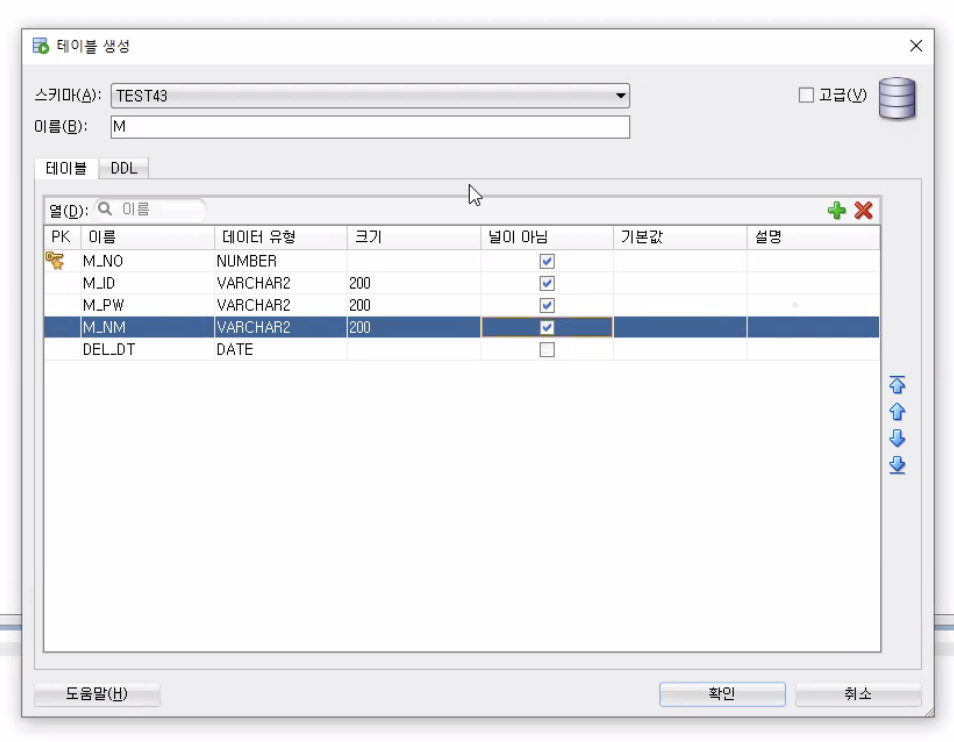
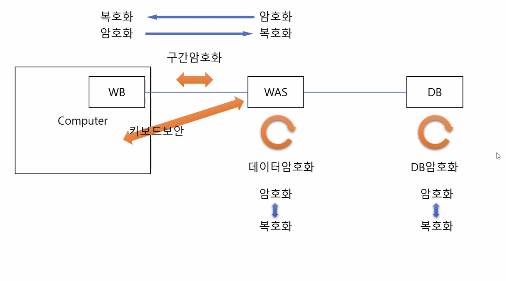
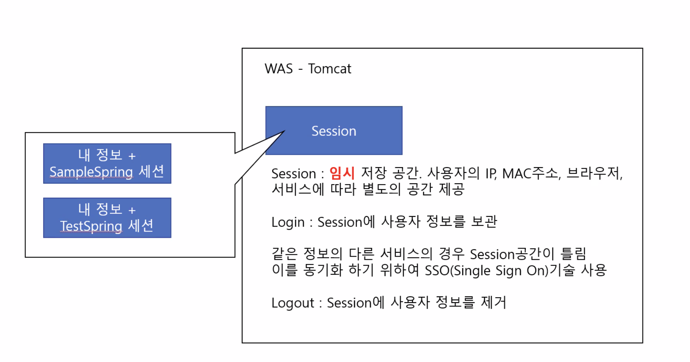
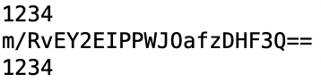

## 회원가입시 ID중복확인, 로그인, 로그아웃

## 회원 테이블로 게시판 목록 + 등록 기능 만들기



- 목록 + 등록 기능 만들기

## ID 중복체크

- DB → M 테이블 편집 → 제약 조건 → 새로운 고유 키 만들고 M_ID 추가

- 컨트롤러 → Writes 주소가 매핑된 메소드에 checkId 메소드 호출해서 개수 받아오기
    
    ```java
    int cnt = iMemberService.checkId(params);
    ```
    

- Service 인터페이스 → Service 클래스 → Dao 인터페이스 → Dao 클래스 메소드 생성 + 오버라이딩

- SQL.XML 에 쿼리 작성 - 테이블에서 M_ID 가 넘어온 id값이랑 겹치는 것의 합계를 넘겨주겠다.
    
    ```xml
    <select id="checkId" resultType="Integer" parameterType="hashmap">
    		SELECT COUNT(*) AS CNT
    		FROM M
    		WHERE M_ID = #{id}
    </select>
    ```
    

- 컨트롤러로 돌아와서 if문 작성
    
    ```java
    		if(cnt == 0) {
    			try {
    				iMemberService.memberAdd(params);
    				
    				mav.setViewName("redirect:memberList");
    				
    			} catch(Exception e) {
    				e.printStackTrace();
    				mav.setViewName("test/memberWrites");
    			}
    			
    		} else {
    			mav.addObject("check", "false");
    			mav.setViewName("test/memberWrites");
    		}
    		
    		return mav;
    ```
    

- memberWrites.jsp → 컨트롤러에서 넘어온 check 값 받아서 활용
    
    ```jsx
    $(document).ready(function() {
    	if('${check}' == "false") {
    		alert("중복된 아이디가 있습니다.");
    		history.back();
    	} else {
    		alert("작성 중 문제가 발생했습니다.");
    	}
    
    });
    ```
    

## 암호화



- CommonProperties.java
    
    ```java
    	/**
    	 * 암호화키(AES기반 16글자)
    	 */
    	public static final String SECURE_KEY = "goodeesmart12345";
    ```
    

객체 생성 없이 사용 가능하고, 변경이 안 되는 상수인 암호화키. 암호화하고 복호화하는 키.

- Utils.java
    
    ```java
    	/**
    	 * 문자열을 key를 통해 암호화 하고 base64 로 인코딩
    	 * 
    	 * @return String
    	 * @throws Throwable
    	 */
    	public static String encryptAES128(String value) throws Throwable {
    		//
    		// AES 암호화
    		//
    		// AES 암호화 키 생성
    		SecretKeySpec keySpec 
    				= new SecretKeySpec(CommonProperties.SECURE_KEY.getBytes("UTF-8"), "AES");
    		// 암호화 객체(Cipher) 생성(AES 방식으로)
    		Cipher cipher = Cipher.getInstance("AES");
    		// 암호화 모드 설정 및 키 할당
    		cipher.init(Cipher.ENCRYPT_MODE, keySpec);
    		byte[] encrypted = cipher.doFinal(value.getBytes()); // 암호화
    		
    
    		//
    		// Base64 암호화
    		//
    		Encoder encoder = Base64.getEncoder(); // Base64 방식의 암호화 객체 생성
    		
    		String encodeString = encoder.encodeToString(encrypted); // 바이트 타입의 배열을 문자열로 변환
    
    		return encodeString;
    	}
    
    	/**
    	 * key 를 통해 문자열 base64 디코딩
    	 * 
    	 * @return String
    	 * @throws Throwable
    	 */
    	public static String decryptAES128(String value) throws Throwable {
    		// AES 암호화키 생성
    		SecretKeySpec keySpec = new SecretKeySpec(CommonProperties.SECURE_KEY.getBytes("UTF-8"), "AES");
    
    		// 암호화 객체 생성(AES 방식으로)
    		Cipher cipher = Cipher.getInstance("AES");
    		// 암호화 모드 설정 및 키 할당.
    		cipher.init(Cipher.DECRYPT_MODE, keySpec);
    		
    		//
    		// Base64 복호화
    		//
    		Decoder decoder = Base64.getDecoder(); // Base64 복호화 객체 생성
    		
    		byte[] decodeBytes = decoder.decode(value); // 문자열 형태의 파라메터를 배열에 바이트 변환 후 삽입
    		
    
    		//
    		// AES 복호화
    		//
    		byte[] decryptBytes = cipher.doFinal(decodeBytes); // 복호화
    
    		return new String(decryptBytes);
    	}
    ```
    

Utils.javad에 encryptAES128 메소드가 AES암호화 키를 만들어줌. (AES128 - 고급 암호화 표준 기술)

SECURE_KEY를 가지고 암호화, 복호화 가능.

- 비밀번호 암호화 적용
    - 컨트롤러에서
        
        ```java
        	@RequestMapping(value = "/memberAdd")
        	public ModelAndView memberAction(@RequestParam HashMap<String, String> params, ModelAndView mav) throws Throwable {
        		
        		int cnt = iMemberService.checkId(params);
        		
        		if(cnt == 0) {
        			try {
        				System.out.println(params.get("pw"));
        				// 암호화
        				params.put("pw", Utils.encryptAES128(params.get("pw")));
        				
        				System.out.println(params.get("pw"));
        				
        
        				// 복호화
        				System.out.println(Utils.decryptAES128(params.get("pw")));
        
        				iMemberService.memberAdd(params);
        				
        				mav.setViewName("redirect:memberList");
        				
        			} catch(Exception e) {
        				e.printStackTrace();
        				mav.setViewName("test/memberAdds");
        			}
        			
        		} else {
        			mav.addObject("check", "false");
        			mav.setViewName("test/memberAdds");
        		}
        		
        		return mav;
        	}
        ```
        

- 암호화 되기 전 pw : 1234
- 암호화 된 후 pw : m/RvEY2EIPPWJOafzDHF3Q==
- 복호화 된 후 pw : 1234



System.out.println(params.get("pw")) 으로 콘솔에 출력됨

따라서 DB에도 비밀번호는 암호화해서 저장됨.

## 로그인

- Login : Session에 사용자 정보를 보관



- 컨트롤러에서 mLogin 주소를 메소드와 매핑
    
    ```java
    	@RequestMapping(value = "/mLogin")
    	public ModelAndView mLogin(ModelAndView mav) {
    		mav.setViewName("test/mLogin");
    		
    		return mav;
    	}
    ```
    

- mLogin.jsp 생성
    - <body> 안에
    
    ```html
    <form action="mLogins" id="loginForm" method="post">
    아이디 <input type="text" id="id" name="id" >
    비밀번호 <input type="password" id="pw" name="pw">
    <input type="button" id="loginBtn" value="로그인">
    </form>
    ```
    
    - <script> 안에
    
    ```jsx
    $(document).ready(function() {
    	$("#id, #pw").on("keypress", function(event) {
    		if(event.keyCode == 13) {
    			$("#loginBtn").click();
    			return false;
    		}
    	});
    	
    	$("#loginBtn").on("click", function() {
    		if(checkEmpty("#id")) {
    			alert("아이디를 입력하세요.");
    			$("#id").focus();
    		} else if(checkEmpty("#pw")) {
    			alert("비밀번호를 입력하세요.");
    			$("#pw").focus();
    		} else {
    			$("#loginForm").submit();
    		}
    	});
    });
    
    function checkEmpty(sel) {
    	if($.trim($(sel).val()) == "") {
    		return true;
    	} else {
    		return false;
    	}
    }
    ```
    

- mLogins 주소 생겼으므로 컨트롤러에서 메소드와 매핑
    
    ```java
    @RequestMapping(value = "/mLogins")
    	public ModelAndView mLogins(@RequestParam HashMap<String, String> params,
    								ModelAndView mav) throws Throwable {
    
    		// 비밀번호 암호화 - DB에 암호화된 pw가 들어가 있기 때문에 암호화를 거침.
    		params.put("pw", Utils.encryptAES128(params.get("pw")));
    		
    		// 사용자 정보 취득
    		HashMap<String, String> data = iMemberService.getLogin(params);
    		
    		return mav;
    	}
    ```
    

- Service 인터페이스 → Service 클래스 → Dao 인터페이스 → Dao 클래스 : getLogin 메소드 생성하고 오버라이딩

- SQL.xml 에 쿼리 작성 - ID와 PW는 식별 데이터라서 조건을 따질 때 사용하고, 가져오는 값은 기준값인 M_NO를 가져와서 활용.
    
    ```xml
    	<select id="getLogin" resultType="hashmap" parameterType="hashmap">
    		SELECT M_NO, M_NM
    		FROM M
    		WHERE DEL_DT IS NULL
    		AND M_ID = #{id}
    		AND M_PW = #{pw}
    	</select>
    ```
    

- 값이 넘어오면 로그인 성공. 넘어오는 값이 없다면 로그인 실패
- Session에 사용자 정보를 보관해야 함.

- 컨트롤러에서 Session을 취득하는 방법
    1. request 이용
        
        ```java
        public ModelAndView mLogins(@RequestParam HashMap<String, String> params,
        								HttpServletRequest req, // 리퀘스트 취득
        								ModelAndView mav) throws Throwable {
        
        // Session 취득 방법 1 : request를 이용
        HttpSession Session = req.getSession();
        ```
        
    2. Spring에게 Session 직접 요청
        
        ```java
        public ModelAndView mLogins(@RequestParam HashMap<String, String> params,
        								// Session 취득 방법 2 : Spring에게 Session 직접 요청
        								HttpSession session, 
        								ModelAndView mav) throws Throwable {
        ```
        

- 정보취득유무 확인해 Session에 값 추가
    - 정보 넘어오면 세션에 정보 추가하고, tbList로 연결
    - 넘어오는 정보 없으면 mLogins로 연결
    
    ```java
    		if(data != null) { // 값이 있으면 true
    			// setAttribute(키, 값) : session에 정보 추가
    			session.setAttribute("sMNo", data.get("M_NO"));
    			session.setAttribute("sMNm", data.get("M_NM"));
    			System.out.println(session.getAttribute("sMNm"));
    			
    			mav.setViewName("redirect:tbList");
    			
    		} else { // 로그인 실패
    			mav.setViewName("test/mLogins");
    		}
    ```
    

- mLogins.jsp 생성
    
    ```java
    <script type="text/javascript">
    alert("아이디나 비밀번호가 다릅니다.")
    history.back();
    </script>
    ```
    

- tbList.jsp에 세션에 넣은 값이 넘어오는지 확인 - JSP EL 태그로 확인
    
    ```java
    ${sMNm}님 어서오십시오.
    ```
    

## 로그아웃

- Logout : Session에 사용자 정보를 제거
- tbList.js에 로그아웃 버튼 생성
    
    ```java
    ${sMNm}님 어서오십시오. <input type="button" value="로그아웃" id="logoutBtn">
    ```
    
- 그리고 <script> 안에 작성
    
    ```java
    $("#logoutBtn").on("click", function() {
    		location.href ="mLogout";
    	});
    ```
    
- 그리고 컨트롤러에 mLogout 매핑
    
    ```java
    	@RequestMapping(value = "/mLogout")
    	public ModelAndView mLogout(HttpSession session, ModelAndView mav) {
    		
    		// invalidate() : 세션 초기화. 데이터 날림.
    		session.invalidate(); 
    		
    		mav.setViewName("redirect:mLogin");
    		
    		return mav;
    	}
    ```
    
- invalidate() : 세션 초기화. 데이터를 날림.